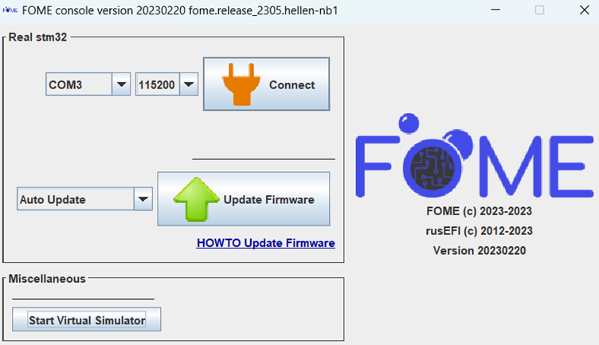
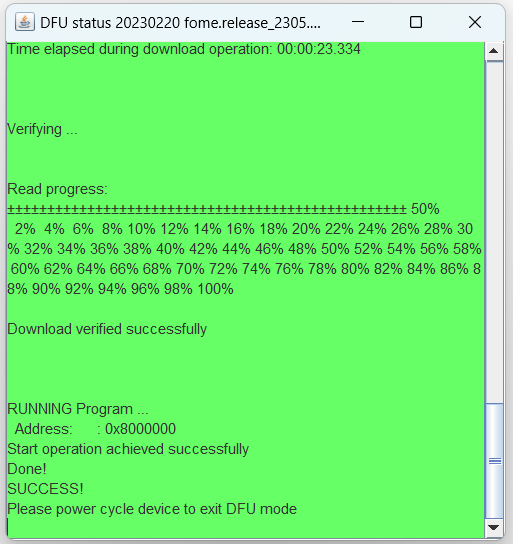
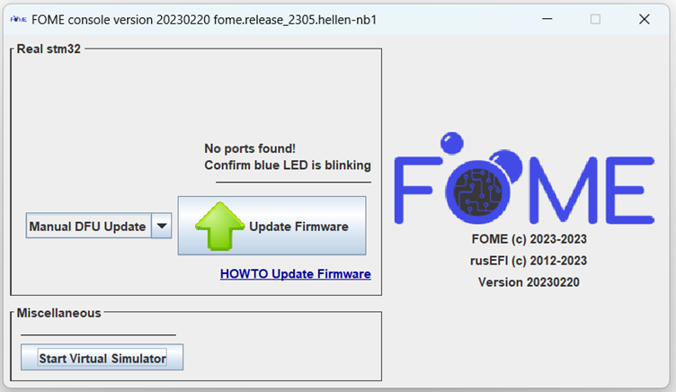
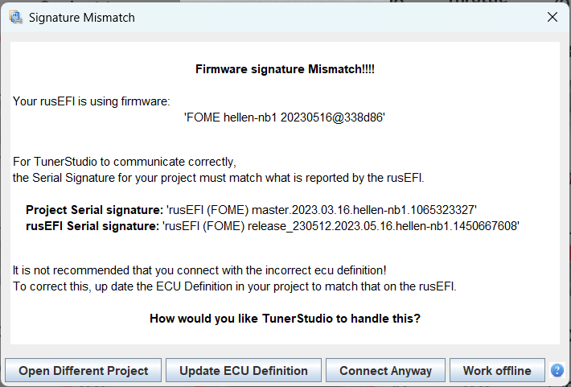
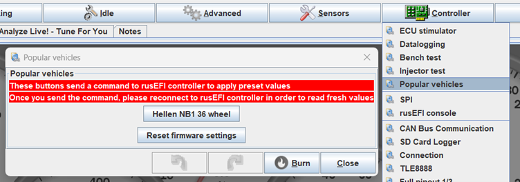
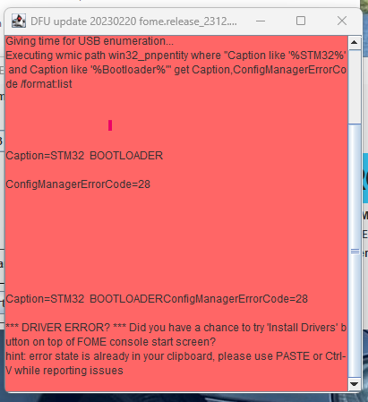
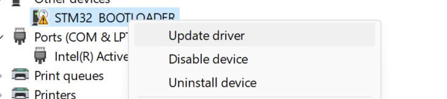
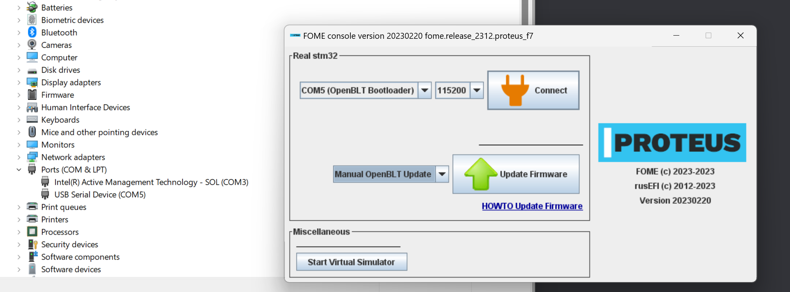

# Updating the firmware

Updating the firmware is easy to do, however it is important to do it correctly to prevent errors or board
misconfiguration.  A guide to downloading FOME firmware and setting up TunerStudio can be found
[here](/Intro-Start-Here/Where-To-Get-Firmware/).

Updating firmware involves a process sometimes called "flashing" or even "programming" the ECU.  Generally, these all
refer to the same thing: taking the compiled FOME firmware and loading it into the non-volatile flash memory on the ECU.

## Updating the firmware with FOME console

After confirming the firmware to flash to the ECU, software to do so must be used.  FOME provides a utility, the **FOME
console**, which is capable of flashing firmware to supported ECUs and is the recommended way to update FOME firmware.
The FOME console is included with each firmware release, and bundles can be downloaded from [the release
page](https://github.com/FOME-Tech/fome-fw/releases).

After extracting the bundle contents,navigate to the 'drivers/' directory and install the drivers. After, navigate to the `console/` directory and run the FOME console program (e.g.
`fome_console.exe` if using Windows).  After first confirming **TunerStudio is not running**, connect the ECU to the
computer.  FOME console will automatically detect the board and present similar to the display below.

Next, choose the *Update Firmware* button and leave the board connected until the console notifies that the update was
successful with a green display.  Only once the console has presented this success message, disconnected and re-connect
the ECU to the computer to reboot it with the new firmware.

If the update completes successfully, congratulations; proceed to [the Setting up TunerStudio
section](#setting-up-tunerstudio).  If the update does not complete successfully, the firmware may need to be loaded by
first forcing the board into bootloader or Device Firmware Update (DFU) mode, documented in the next section.

## Updating firmware via manual bootloader/DFU mode

In the event of a firmware update/flash failure, or some other firmware corruption issue, such that FOME console nor
TunerStudio recognize the ECU when connected, the board needs to be first forced into bootloader mode before updating.
In these situations, the FOME console cannot communicate with the firmware and so is unable to configure it into
bootloader mode for updating.

To enter bootloader mode, on the ECU you will need to access buttons or pins on the main board to force the processor
into this mode.  Some boards use a momentary button, likely near to the reset button, to force this mode during
power-up.  Others might use a set of pins or pads that need shorted to force this mode during power-up.  Press the
button or short the pins with the ECU disconnected from the computer, then simultaneously connect the ECU into the
computer.  Once connected, the button can be released or the short removed.

When a board has been successfully booted into bootloader/DFU mode, the FOME console will recognize this and display the
manual DFU update selection.

Next, choose the *Update Firmware* button and leave the board connected until the console notifies that the update was
successful with a green display.  Only once the console has presented this success message, disconnected and re-connect
the ECU to the computer to reboot it with the new firmware.

## Setting up TunerStudio

With the ECU connected, open TunerStudio with the associated project.  TunerStudio will recognize that the project's ECU
definition is out of date and display a prompt to update it.  Choose the *Update ECU Definition* button, which will
attempt to automatically update the definition from official sources.  If an official definition cannot be found,
manually load the `.ini` definition file associated with the firmware (i.e. from the downloaded bundle).

Next, under the *Controller* tab, open the *Popular vehicles* menu and choose the top button (e.g. *Hellen NB1 36 wheel*
as shown here) to load the preset for your vehicle (**not the button to *Reset firmware settings***).

Once the preset has been loaded, you can either start tuning or load your tune from the older firmware versions under
*File > Load Tune (msq)*. After that, the update is complete!

## Troubleshooting updates prior to release FOME 2312

If an error persist during the DFU update for release 2312 a manual driver update may be required. 

When the FOMEconsole prompts with a ConfigManagerErrorCode=28 proceed by opening Device Manager. Look for the following device "STM32 BOOTLOADER" It may be under 'Other Devices'. 

Right click STM32 BOOTLOADER and select 'Update Drivers'

Select 'Browse my computer for drivers' and proceed to Browse and have windows update the drivers for STM32 BOOTLOADER by directing it to 'Drivers/silent_st_drivers/'

Proceed to unplug the ECU and retry the install. If another DFU update error persist such as "Data mismatch found at address" or "looks like ECU didn't reboot to OpenBLT"

Proceed to unplug the ECU and retry the install. At this point, the FOME console should have detected the ECU as OpenBLT Bootloader. Proceed by updating the firmware "Manual OpenBLT Update"

If prompted with Update completed successfully, proceed with power cycle. From this release onwards the ECU can be updated using OpenBLT and should not require any manual driver installs.

