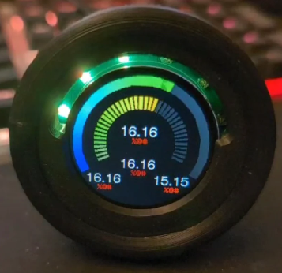

# BeerMoneyMotorsports KaN (CAN) Gauge

Product description and purchase link: [BMM KaN Multi Fit CAN Gauge](https://www.beermoneymotorsports.com/products/kan-gauge-for-rusefi).

The KaN gauge is a multi function, multi fit gauge designed exclusively for the Beer Money Motorsports line of ECUs. The gauge is designed to fit into multiple locations on a Miata including the oil pressure gauge hole, an air conditioning vent or into a standard 52mm gauge pod. Data is sent to the gauge via CAN bus communication wires coming from the ECU and the layout of the gauge can be configured wirelessly using its standalone WiFi network. This article will detail the installation and setup of a gauge into your Miata.

## Wiring

Open your ECU casing and locate a 5/12V output, ground, CAN High, and CAN Low pins. Match each of these pins to one of the four corresponding wires on the gauge. For best signal over long distances, twist the pair of CAN lines.

## WiFi Configuration

When powered, the gauge will start its own standalone wifi network. In the WiFi settings for your device, connect to this network with a phone or laptop and open your browser of choice. Next find the IP address of your gauge. It should be a number like "192.168.X.XXX" which was included with your gauge purchase. In the browser's web address bar, input this IP address of the device into the browser and go to the web page. 

The web page should detail the gauge settings to allow for customization of the theme and displayed values.

## Physical Installation

Several options are available to mount the gauge on a Miata depending on where you like your gauges, how much you like air conditioning, and how much you like removing your dashboard.

## Oil Pressure Gauge Mounting

This is by far the most neat and integrated installation spot. If installing the gauge here, it is recommended to also install an aftermarket oil pressure sensor to the ECU so that the gauge can display your oil pressure among other useful variables

## Air Conditioning Vent Mounting

Another clean installation method is to replace an air conditioning eyeball vent on an NA/NB Miata with a 52mm gauge housing.

## 52mm Gauge Pod Mounting

With the 52mm housing option, the gauge can be mounted into any 52mm gauge pod housing which is the standard size for aftermarket automotive gauges. For Miatas specifically, there are a range of gauge pod mounts fitting to locations like the A pillar, in place of the radio console, on top of the gauge cluster, etc.

## Bare PCB Mounting

Purchasing the gauge as a bare PCB allows you to design your own mounting solution. Mount the gauge anywhere from behind your steering wheel to inside a cup holder!