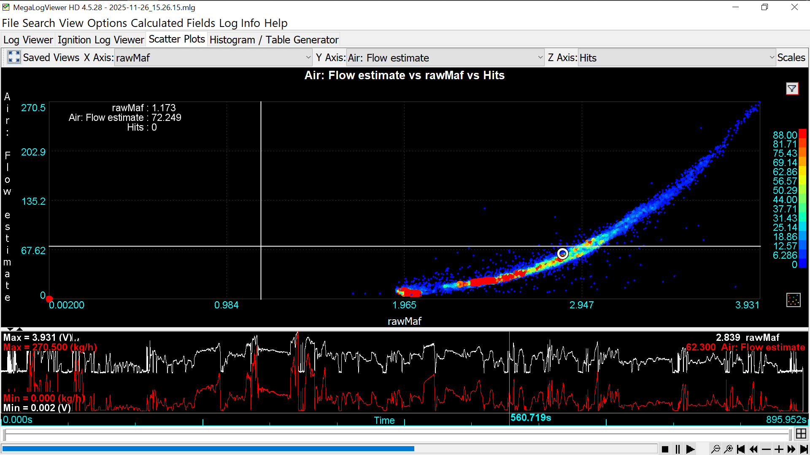

# Mass Air Flow Meter

A MAF (Mass Air Flow) sensor measures how much air is entering the engine. The engine computer (ECU) uses this information to calculate how much fuel to inject so the air-fuel mixture stays correct. Most MAFs work by sensing how much incoming air cools a heated element, which tells the ECU the mass of the air, not just its volume. The MAF sends a voltage back to the ECU (the raw MAF) which is then converted to an actual MAF value in Kg/h units using a calibration curve.

## TunerStudio Setup

By default, most ECUs will be set to run on mass air pressure (MAP) not MAF. Under __Base Engine>Base Engine Settings>Fuel strategy__, change it to ___MAF air charge__. Under __Sensors>MAF Sensor__, ensure that the MAF ADC input is set to the correct pin on the ECU (it will likely be labelled as MAF). 

Next in the sensors tab, open the __MAF Transfer Function__ setting. This graph represents the corporation between the MAF raw voltage and the actual MAF reading. If data is available for your specific MAF, that can simply be copied across and used (cautiously checking it when driving for the first few times). If MAF data is unavailable, it can be approximated which is detailed below.

## MAF Transfer Function Approximation

Ideally, connect the MAF to a calibrated air flow bench and collect the transfer function voltage vs Kg/h data that way. Most users however are unlikely to have access to this but luckily the function can be approximated using the data logging features on the car and the following steps:

### Preliminary Approximation

1. Ensure the car is set to run on __Speed Density__ in __Engine>Base Engine Settings>Fuel strategy__ (__NOT MAF AIR CHARGE__) and has a drivable tune to run on the mass air pressure (MAP) sensor. This means the MAP line needs to be installed. Ideally have DFCO and closed loop fuel correction disabled.

2. Connect the MAF sensor and ensure that the MAF ADC input is set to the correct pin on the ECU (it will likely be labelled as MAF). The MAP pin assignment is under __Sensors>MAF Sensor__.

3. Take the car out for a drive at different engine loads and ensure it is logging data either to the laptop or onboard SD card.

4. After the drive, open the data log in Mega Log Viewer and under the scatter plots tab, create a plot of __rawMaf__ on the X-axis, __Air: Flow Estimate__ on the Y-axis, and __Hits__ on the Z-axis. This will create a __preliminary__ starting curve to use for calibrating the MAF. This curve is essentially plotting the derived MAF value on the Y-axis using the actual MAP data and other sensors vs the actual MAF sensor voltage.

1. Copy the preliminary curve across to the ___MAF transfer function__ under __Sensors__. It only needs to be a rough approximation as it will be refined from here.

### Refined Approximation

Now using the preliminary curve and the actual MAF readings, the transfer function will be improved.

1. Under __Base Engine>Base Engine Settings>Fuel strategy__, change it to ___MAF air charge__. Ensure that DFCO and closed loop fuelling are also off.

2. Save/export your current VE table so as not to loose it. Set all values to 100. In the AFR/lambda target table, set all values to 14.7/1.0 respectively.

3. While logging, take the car out for a drive being smooth with the throttle inputs and with a large range of engine loads.

4. Open the log in Mega Log Viewer and load the log. Under __Calculated Fields>Custom Fields__ select __Add Custom Field__. Name it __Target_MAF__ and use the equation: [MAF]*[Lambda 1]/[Fuel: target lambda]. This equation calculates the corrected MAF value using the actual MAF value and the lambda sensor.

5. Create a scatter plot with __rawMaf__ (volts) on the X-axis, __Target_MAF__ (Kg/h) on the Y-axis, ans __Hits__ on the Z-axis. The scatter plot should hopefully produce a relatively defined transfer function. Open the ___MAF transfer function__ and add the average points of the scatter plot transfer function to it.

6. You should now have a reasonably calibrated MAF sensor. You can now reset the VE and target lambda tables to their previous values and take the car out for a __careful__ drive. From here, it is recommended to use the __Tune Analyze Live__ tool in TS to fully dial in the VE for the MAF as there will likely be some inaccuracies which the VE table will absorb.