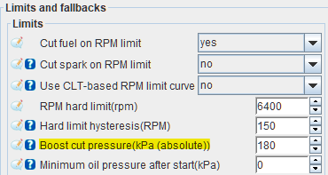

# Boost pressure limit  

Boost pressure limit can be found under __Base Engine > Limits and fallbacks__.

## Boost cut pressure

This setting defines the upper limit of pressure the engine will operate within. If the engine's MAP reading exceeds the value configured in __Boost cut pressure__, FOME will cut fuel injection until the MAP reading falls 20kPa below the configured value. The 20kPa hysteresis value is hard-coded.

This value is absolute pressure, so if an engine is running 7 PSIG of boost pressure (~148kPa absolute), this value would need to be set above 150kPa. It is a good idea to allow enough of a margin to prevent unnecessary boost cut on small excursions above the target boost pressure.

Set this value to 0 to disable the boost cut limit.
