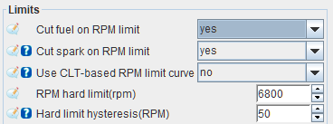
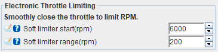

# Rev limiters  

Rev limiters can be found under __Base Engine > Limits and fallbacks__.

## Hard cuts  

Hard cuts apply when an engine reaches the __RPM hard limit__. In most cases, it is recommended to use fuel cut instead of spark cut.

### Fuel cut  

If __Cut fuel on RPM limit__ is set to _yes_, FOME will stop injecting fuel once the engine reaches the __RPM hard limit__. The engine speed must drop below the __RPM hard limit__ by the number of RPM specified in __Hard limit hysteresis__ before fuel injection is resumed.

### Spark cut  

If __Cut spark on RPM limit__ is set to _yes_, FOME will stop firing the ignition coil(s) once the engine reaches the __RPM hard limit__. The engine speed must drop below the __RPM hard limit__ by the number of RPM specified in __Hard limit hysteresis__ before ignition is resumed.

:::danger  

If __Cut fuel on RPM limit__ is set to _no_ then fuel will continue to be injected during the spark cut. This can cause a build-up of unburned fuel in the exhaust system which may ignite when ignition resumes and can cause damage to the engine and exhaust system.

:::

:::warning

Cutting spark can lead to engine valvetrain damage due to the immediate reduction in torque. It is recommended to use fuel cut instead of spark cut in most cases.

:::

### Both cut  

Both fuel cut and spark cut can be used together. This reduces the risk of unburned fuel in the exhaust when using spark cut, but the risk of valvetrain damage still applies. 

## Soft limiting  

### Electronic Throttle Limiting  

Engines equipped with an Electronic Throttle Body (ETB) can utilize Electronic Throttle Limiting. This will smoothly close the throttle starting at the __Soft limiter start__ engine speed and fully close it once the engine speed has increased by the number of RPM defined in __Soft limiter range__.

For example, if __Soft limiter start__ is 6000 RPM and __Soft limiter range__ is 200 RPM, the maximum ETB position possible at 6100 RPM is 50%, and at 6200 RPM the electronic throttle will be fully closed even if the accelerator pedal is commanding a larger opening.
