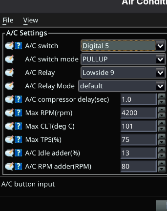

# Air Conditioning Settings

FOME supports controlling an air conditioning accessory powered from the engine.

A 5 °C deadband on the A/C max coolant temperature limit means that a 100 °C setting effectively becomes a 105 °C setting in practice.
