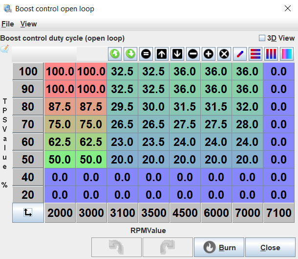

# Boost Control

Before you start tuning the boost control, it is essential the make sure that you have a safe boost cut pressure set under _Base Engine > Limits and Fallbacks_. Within this menu, it is also recommended to set only fuel to be cut on the RPM limit as cutting fuel and spark can lead to excess fuel igniting inside the turbine housing causing excess wear to the turbo.

Electronic boost control (EBC) is a method of controlling a vehicle's boost from an ECU or boost controller. EBC allows for more precise control of boost resulting in the ability reduce spool up time, set the boost to an exact figure or tune the boost to flatten a torque curve.

## Boost Control Options

### Three Port Boost Control Solenoid

A three port boost control solenoid works by quickly alternating between diverting boost pressure to atmosphere and to the wastegate. By adjusting the duty cycle or time spent diverting air to atmosphere, the solenoid effectively changes the boost pressure that the wastegate sees allowing it to stay closed for up to three times the wastegate spring pressure.

For most vehicles, this is the most common method of electronic boost control as it it cheap, can be easily plumbed into most turbos and for the most part does a good job of controlling the boost.

A three-port boost solenoid has three ports: an inlet port, an outlet port, and a control port. The inlet port is connected to the turbocharger outlet, the outlet port is connected to the wastegate actuator, and the control port is connected to the ECU. The ECU sends a signal to the control port to regulate the amount of boost pressure produced by the turbocharger.

### Four Port Boost Control Solenoid

A four-port boost solenoid has an additional port, known as a reference port. The reference port is connected to the intake manifold or the atmosphere, and it provides a reference pressure to the boost solenoid. The boost solenoid uses this reference pressure to regulate the boost pressure produced by the turbocharger. The four-port design allows for more precise control over the boost pressure to a three port solenoid because it takes into account the reference pressure in addition to the control signal from the ECU. By bleeding off excess pressure when needed, the four-port boost solenoid can maintain a consistent and accurate boost pressure, resulting in better performance and reliability for the turbocharged engine.

### Electric Wastegate Actuator

An electric wastegate actuator replaces a conventional spring based wastegate with an electric actuator to regulate the boost pressure.

## Open Loop Boost Control

Open loop boost control is the simplest form of electronic boost control where the boost control solenoid is assigned a specific duty cycle based on the engine RPM and throttle pedal position. With open loop control, you need to guess what duty cycle will correspond with your desired boost pressure and work from there. An example of on open loop boost control table is shown below.

## Tuning Open Loop Boost Control

Before you start tuning the boost, consider what you are looking for the boost controller to do. Do you want the fastest possible spool up? Do you want the boost to come on all at once or progressively build up? Do you want to accelerate as fast as possible right on the limit of grip or to spin the tyres?

1. Decide what the minimum boost pressure you want to run will be and install the corresponding wastegate spring.

1. Disconnect any boost control solenoids and connect the wastegate directly to a source of boost pressure.

1. Verify that the boost cut works by setting it to a low value such as 100kPA. Once verified that it works, move it 10-20kPa above your desired boost pressure.

1. Take the car for a drive doing a range of pulls and take notice of how the boost responds. In first and second gear, when does the car move into boost and when does it stabilize? In higher gears, when does the car move into boost and when does it stabilize? Once the boost stabilizes, does the boost curve increase, decrease or stay flat? As an example, say that you have a turbo Miata running at sea level (100kPa atmospheric pressure) and the turbo moves into positive boost at 2000RPM and stabilizes at 3500RPM where it stays at 150kPA (50kPA or ~7PSI of boost) until redline.

1. The safest way of determining the ideal duty cycle for your boost goals is to start at the minimum and work up from there. Start by setting every cell on the open loop table to 20% duty cycle and do several full throttle pulls in 2nd-4th gear noting the boost it reaches. 20% is generally the minimum duty cycle the solenoid needs to run and this can be tested by turning the key to _On_ and with the engine off, push the throttle listening for the solenoid clicking. Gradually increase the duty cycle in steps of up to 5% until the car car reach your desired boost pressure at full throttle.

1. Once the desired boost pressure is reached, look at how the boost curve moves once it stabilizes. If it continues to rise past target pressure, progressively raise the duty cycle in the table as the RPM increases. If the boost drops, do the opposite and raise the duty cycle as the RPM increases. Continue to adjust the duty cycles until the stable boost stays within 5-10kPA of target.

1. In your boost control table, decide on the minimum throttle position where you would like the boost control to activate. 40-50% is generally a good starting point. Below the starting point, set every cell to zero. At the starting throttle position row, set the duty cycle to the minimum duty cycle required to operate the boost solenoid which is usually 20%. Now interpolate vertically between the minimum boost throttle position row to the 100% throttle position row so that at in a given RPM column, the duty cycle will increase as the throttle is pushed more.

1. Optionally for a fast spool up time, recall what RPM the boost reached target in 3rd or 4th gear. Now rescale the table by so that the new lowest or second lowest RPM column is 1000RPM below the boost target and the second or third RPM column corresponds to the RPM when the boost target is reached. Set the columns below target boost to 100% and test it out with some pulls in different gears. Progressively raise the RPM of the 100% duty cycle columns as much as you can before the boost goes above the target pressure and leave them there. It is recommended to back off the 100% duty cycle RPM slightly from the absolute highest it can be as a factor of safety. To make transition to boost smoother, the 100% duty cycle columns can also be vertically interpolated between 100% and a lower duty cycle such as 50% at the minimum boost RPM.

## Closed Loop Boost Control

Closed loop boost control builds on the open loop boost controller and actively adjusts the solenoid duty cycle to reach the specified target pressure. The controller starts at the specified duty cycle in a given cell in the open loop table and adds or subtracts to that value until the target pressure is reached. The closed loop boost controller uses a PID controller to adjust the duty cycle. A PID controller works by measuring the error between the measured boost and the desired boost and calculating values for the P, I and D terms based off of the error. These terms are then added togethor to form the calculated duty cycle which the controller will measure the boost pressure response to and will continually adjust its calculated duty cycle until the target pressure is achieved.

The P-term multiplies the duty cycle per kPa of error. For example, if P is set to 0.2 and there is a 20kPa error, it will add a value of `0.2 * 20 = 4%` to the duty cycle.

The I-term multiplies the duty cycle by the kPa of error and the seconds that there is error. For example, if I is 0.1 and there is 10kPa of error for 2 seconds, it will add a value of `0.1 * 10 * 2 = 2%` to the duty cycle.

The D-term multiplies the duty cycle by the kPa of error per second (or rate of change of kPa). For example, if D is 0.2 and the boost is rising at 10kPa per second, a value of `0.2 * 10 = 5%` would be subtracted to the duty cycle to slow the rate of approach to the target.
