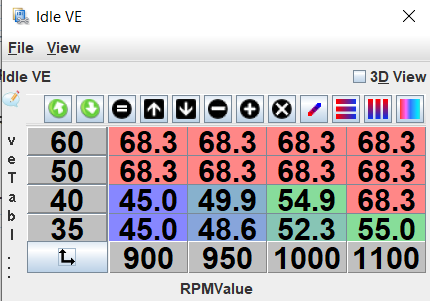

# Idle Specific VE Table

The idle specific VE table is a smaller 4x4 table referenced only when the engine is operating in the idle condition. As the engine is under very little load during idle, changes in engine load can have a significant effect on the AFR. These loads can be from the air conditioning compressor engaging or from the alternator duty cycle increasing from extra electrical loads such as cooling fans, headlights or even electric windows. By adjusting the idle VE table to encapsulate the finite idle RPM and load ranges, you can tune the idle to operate close to the AFR target regardless of the engine load.

To tune the idle VE, make sure _closed loop fuel correction_ under _Fuel_ is disabled. Proceed to warm the car up and switch off all cooling fans, headlights and air conditioning. Tune the corresponding idle VE table cells until the AFR target is reached. Now turn on the accessories one by one, tuning the corresponding cells the idle VE table. Next repeat this process with multiple accessories on at once such as the air conditioning and headlights. Once the cells have been tuned, interpolate to fill any unused cells and smooth the cells together. In the circumstance that engaging the accessories has a large effect on the AFR, you may not be able to smooth the table much.
