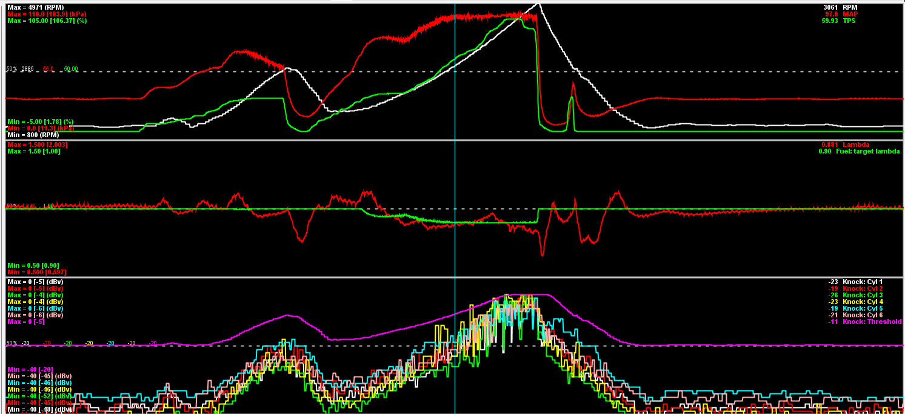
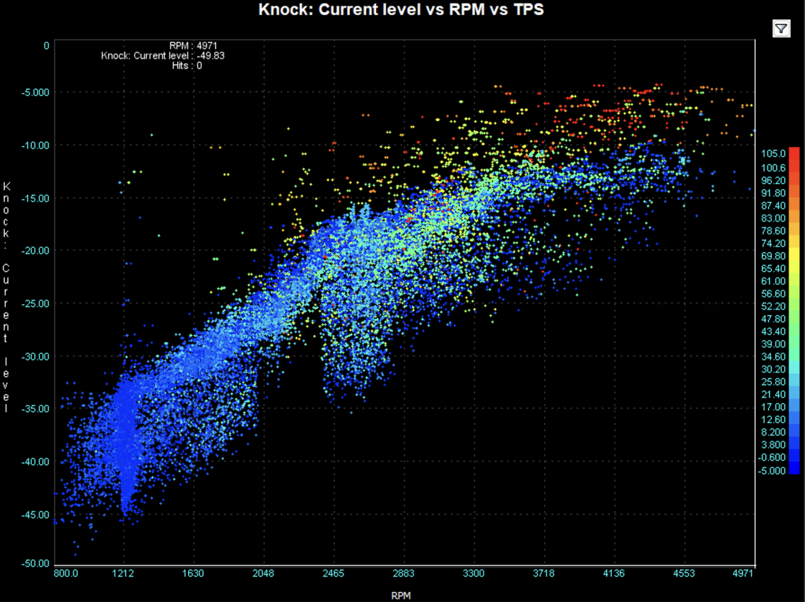
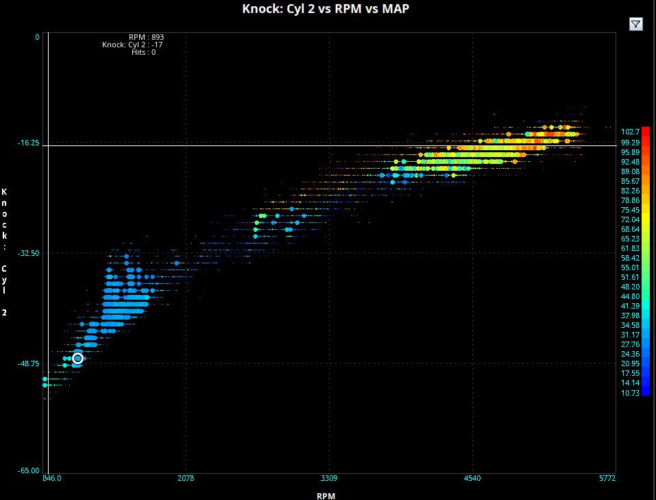

# Knock Detection Setup Guide

## Choosing a Knock Sensor and Basic Setup

Knock sensors are, essentially, microphones.  Some have a built in attenuation to mechanically/acoustically filter around a certain frequency (most older sensors, i.e. Gen3 GM V8) and most newer ones are "flat" response (i.e. most "donut" Bosch).  As the processing power available on the OEM ECUs improved, there was a trend towards doing filtering in software and using flat-response sensors.  Using a knock sensor from a newer (2010+) vehicle is probably a good idea because newer sensors are more likely to be flat-response.  The algorithms in FOME are designed for flat-response sensors.

Knock sensors are going to register noise from the engine.  FOME tries to separate this noise from knock from cylinder pressure by looking for specific frequencies determined by physics. It is impossible for knock sensors to not also pick up other noise.  Solid engine mounts can drive knock sensing systems batshit.  Tires and poor alignments can show up in knock sensor data, especially with solid mounts.  Bearings in idler pulleys can show up as engine RPM or harmonic-of-RPM noise.  Anything that transmits vibration into the engine will compete with the noise from combustion knock that you are trying to sniff out.  Also, electrical interference can contaminate the signal from knock sensors.  Most often, this comes from poor grounding or proximity of knock sensor wiring to sources of electrical noise like alternators and ignition coils or wires.  Shielded wires to knock sensors can help alleviate this.

Knock sensor placement can also have a huge role.  Many newer engines have multiple knock sensors for this reason.  You may need to try different mounting locations.  If you know that the engine you are dealing with is known for having problems on a particular cylinder, you may want to place the knock sensor closer to that cylinder.

Bottom line: to get the most out of FOME's knock control, setup and configuration for the individual setup is needed.

## Basic Setup Process

1. Enable the knock sensor and calculate the knock frequency using an approximation formula.
2. Remove ignition timing from the ignition map, adjust other parameters to prevent pre-detonation events.
3. Record a log of engine performance and knock sensor levels across full RPM range.
4. Restore the tune and maps to its original configuration.
5. Review log data to create a baseline curve for knock detection.
6. Adjust knock retard aggression to determine the level of response.
7. Set up the Max Knock Retard table to define maximum allowable ignition timing retardation.

:::warning
The following steps assumes your ECU is running a recent release of FOME (i.e. 2312 or newer)
:::

1. __Enable the knock sensor__, and calculate the estimated knock filter frequency (kHz). For now, configure the first setting “cylinder bore” as 0.00mm.

   - An adequate approximation formula for Knock Frequency is “Knock Frequency = 900,000/(π {'*'} 0.5 {'*'} cylinder bore diameter )”
   - Once the approximated knock frequency is calculated, use the second-order harmonics of the estimated frequency. The second-order frequency are multiples of the original calculated frequency. So twice the Knock Frequency. We do this to increase sensitivity, improve signal to noise ratio, and general “robustness” in frequency analysis.
   - For now, Set knock detection window start to 0.00, This feature is for advanced users only.

   - This formula is derived from the relationship between the speed of sound, the bore diameter, and the frequency of knock waves. It assumes that the speed of sound is approximately constant and that the knock waves travel at a specific angle through the combustion chamber. As an example, the NA6 Miata’s estimated knock frequency is 7300 Hz or 7.3kHz & its 2nd order harmonic would be 14.60Khz.

:::danger
The next few steps assume your car is running well enough to take a low-load full rpm log to define the engine knock threshold curve.
:::

:::info
An engine knock threshold curve shows how the sensitivity of knock sensors changes with engine speed. It's a graph where the horizontal axis represents engine speed (in RPM) and the vertical axis shows the knock sensor's sensitivity level (in dBV). Tuning this curve ensures the ECU reacts appropriately to protect the engine while maximizing performance.  Each setup is going to have a unique curve.  Factors such as engine mounts, valvetrain components, bearings in accessories, electrical noise getting into knock wiring can affect this.  Experimentally measuring the curve is the best way to get good results.
:::

<!-- markdownlint-disable MD029 -->
2. __Start by removing ignition timing__ from the ignition map, an approach is to remove at least 3 degrees of timing, increase octane rating, decrease boost and any other parameters that can contribute to pre-detonation events.  When determining a baseline knock curve, you want to be CERTAIN that the engine is not knocking.

3. __Record a log at a minimum of 100 Samples per second from idle to redline__ (Under Communications/Data Rate). This can be performed in a few ways. The better the Data, the better the Threshold curve:
    - On Jack stands with slight load applied such as brakes
    - Driving on the road in a controlled fashion
    - Monitoring engine noise in deceleration while the injectors are cut is a valid method.  This sometimes neglects noise from belt-driven accessories and should not be relied on for supercharged vehicles or vehicles with lots of belt-driven accessories.
    - It is CRITICAL that the engine is not knocking when you record this data.

4. __Restore the tune back to the previous configuration__ (restore any timing removed, adjust AFR targets, etc.).

5. __Review the log in MegaLog Viewer and generate a scatter plot__ of the “Knock: Current Level” vs RPM:
    - Ideally the plot is the low-load noise of the engine throughout the whole rpm range. It should look something like this below. 
        - Further filtering can be applied in megalog viewer to remove high manifold pressure and deceleration noise. Use these expressions to help analysis the measured data.
            - Deceleration : “ [RPM-4]{'<='}[Field.RPM]&&[TPS]{'<'}50 “
            - High Load : “ [Ign: Load]>60 “
    
    - Once the above plot for your engine has been generated, we can use this data to create a plot that will be used in Tunerstudio’s table on the bottom right. This is a baseline curve, further logs can be taken and more data analysis can used to refine the curve.
    - The curve used in Tunerstudio should fit over the top of the low-load noise and also be “tight” to the measured data. As shown below, the orange scater is all the data less than 60kpa and the grey is a curve can be used as a baseline threshold in Tunerstudio.
        - An active system is better than one missing low level knocks
    
    

6. __Set up the Response of the Knock controller’s parameter “Knock retard aggression”__ A generalized rule of thumb would be 5% is considered adequate where as 15% being very aggressive:
    - The knock retardation amount is determined by calculating the distortion from the optimal ignition timing, multiplying it by the configured knock retard aggression percentage to determine the desired retardation, and then applying this retardation to the current knock retardation value.

7. __Set up the Max Knock Retard table__:
    - The max knock table defines the maximum allowable knock values that the knock controller can use to retard ignition timing, with the Y-axis representing ignition load, the X-axis engine speed in RPM, and the Z-axis indicating the degree of timing retardation permitted for each combination of load and speed.
    

## Recommended Threshold Settings

A good starting point is setting your threshold approximately 4dB above normal engine sound levels. This provides enough margin to avoid false positives while still detecting actual knock events.

## Interpreting Knock Data

Signal-noise ratio comes into play here.  Your knock sensor is going to capture noise because engines are loud.  Some of that noise is going to be "normal" things like timing gears, pumps, belt-driven accessories, bearings, the gears of a supercharger, vibrations/harmonics between the engine and the frame of the car with solid mounts, injectors tapping, etc.  This is the "noise" in signal-noise ratio for knock purposes.  The "signal" is the auditory component of knock from each cylinder.  One of the reason why most OEMs have independent gains for each cylinder is that the SIGNAL is not the same amplitude for each cylinder, so gains are used to compensate.  Looking at individual cylinder scatter graphs are going to help determine appropriate gains for each cylinder.

You can get better knock sensing performance by either increasing the "volume" of knock events (generally: move the knock sensor closer to the cylinder, etc.) or decrease the ambient "noise" (fix loud bearings, use softter engine mounts, etc.).  If you quiet the engine down by decresing "noise" then knock energy will stand out more.  Simple idea, sometimes difficult implementation.

Here's an example of sharp spikes which are knock

The scatter plot is also useful. Knock generally shows up as outliers outside of the normal noise envelope, especially at high load

Contrast the image above to a normal noise scatter plot (no knock), which might look like this

The normal noise scatter plot also has a significantly better (higher) signal-noise ratio than the knocking plot above.  Independent of the knock events, noise levels occur in a smaller range and the vertical size of the "band" across all RPMs is much smaller.  The smaller vertical distance can be interpreted as noise levels being more consistent.

Knock appears as sharp spikes in the time domain. Since knock is a stochastic process, you won't necessarily get the same knock on every cycle. Look for patterns such as:

- Correlation between knock level and throttle position at constant RPM
- Spikes in knock level that correspond to specific load conditions
- Cylinder-specific knock patterns

## Reapply Rate Configuration

Setting the reapply rate can be tricky:

- Low load conditions need faster reapply rates
- High load conditions need slower reapply rates

Some users implement a workaround by using zeros in the bottom line of the max knock retard table.

## Hardware Connections

The knock sensor is essentially a piezo microphone element:

- For testing/analysis, you can attach a 3.5mm connector to your knock sensor wires and plug into a laptop
- The knock input on ECUs (like Proteus) is very different from a normal analog input
- The sensor connection is balanced, similar to audio equipment principles

## Common Issues & Debugging

1. __No Timing Retard__: Ensure your max knock retard table isn't all zeros
2. __False Positives__: If you're getting knock detection without audible knock, recalibrate your threshold
3. __Noise Filtering__: In TunerStudio, set filter level to 2 to clean up MAP signals and reduce noise
4. __Rich Mixtures__: Beyond 0.8 lambda, additional fuel enrichment won't help with knock mitigation

## Advanced Analysis

For deeper knock analysis, consider using a spectrogram to visualize the frequency characteristics of engine noise and knock events.

*Remember: When setting up knock detection, it's prudent to start with conservative timing and gradually optimize rather than risking engine damage.*
