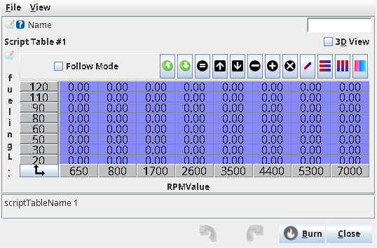
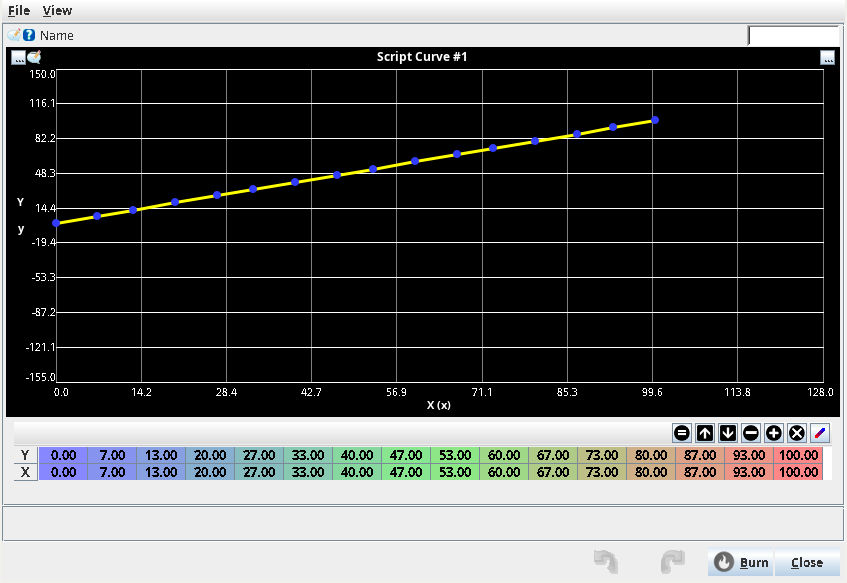
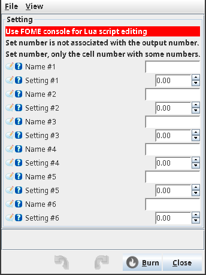
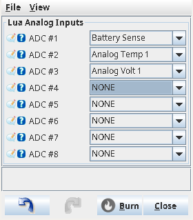
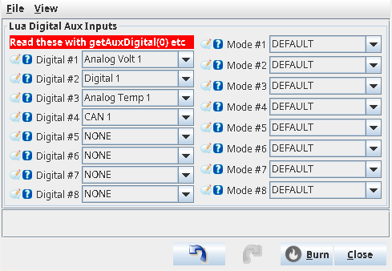
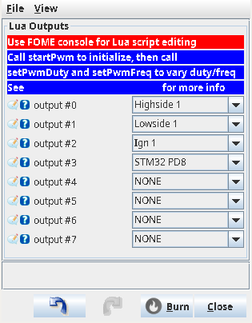

# Lua Scripting

## Introduction

FOME extends and customizes firmware functionality and behavior through an embedded [Lua
interpreter](https://www.lua.org/docs.html). Sensors, signals, and engine controller state are exposed for reading
and manipulation, allowing the user to tailor a control strategy to fit a specific application's needs.

This page documents the most up-to-date version of FOME's Lua scripting support: not all interfaces are supported in
earlier versions.

## Overview

FOME exposes a Lua interface comprising a number of functions and types for inspecting and manipulating firmware
state and configuration. At a high level, the interface is organized into these categories:

- A small utility library, including timers, PIDs, and user-defined lookups; see the [Utilities](#utilities) reference.
- General input and output; see the [Input and Output](#input-and-output) reference.
- Sensor reading and Lua-controlled sensors; see the [Sensors](#sensors) reference.
- Engine controller state, calibration, and per-cycle adjustments; see the [Firmware State and Control](#firmware-state-and-control) reference.
- CAN bus communication; see the [CAN Bus](#can-bus) reference.
- Subsystem-specific hooks for [Launch Control](#launch-control), [Boost Control](#boost-control), [Crankshaft Position Input](#crankshaft-position-input), and [Vehicle Speed](#vehicle-speed).

For examples, see the files in FOME's [`lua/examples/` directory](https://github.com/FOME-Tech/fome-fw/tree/master/firmware/controllers/lua/examples/).

For a basic introduction to the Lua language itself, see the [Lua reference manual](https://www.lua.org/manual/5.4/).

## Conventions

- The Lua interpreter will trigger an error if there is a mistake in the program: check the FOME Console to see errors and script output.
- Index conventions vary by function. Most `index` parameters (e.g. PWM channels, aux analog/digital, digital I/O) are 0-based, but tables, curves, Lua gauges, persistent values, and CAN bus channels are 1-based, matching their numbering in TunerStudio. Each function's documentation calls out the correct range.

## Writing Your Script

The entire Lua script is read and validated at startup, then a global script function named `onTick` is invoked periodically by the firmware.

Here is a simple script to illustrate this behavior:

```lua
print('Hello FOME via Lua!')

function onTick()
    print('FOME called onTick()')
end
```

## User-Defined Lookup Tables and Curves

FOME provides for user-defined lookup tables and curves for use with Lua scripting. These tables and curves are set in
the FOME configuration (via TunerStudio) and lookups are interpolated along their definition.

The tables and curves have user-definable names up to sixteen characters long. Their names and definitions are
configurable in the *Advanced > Lua Calibrations* menu in TunerStudio.

### 3D Tables

FOME provides four user-definable three-dimensional tables for use with Lua scripting. The first table affords the most
precision, defined by single-precision floating-point values, while the remaining three tables are defined by 8-bit
integers; all tables are eight by eight in dimension, defined by 16-bit integer coordinates.



Two functions are provided to interact with the user-defined tables:

- [`findTableIndex(name)`](#findtableindexname)
- [`table3d(index, x, y)`](#table3dindex-x-y)

### 2D Curves

FOME provides six user-definable two-dimensional curves for use with Lua scripting. The first two curves afford the
most accuracy, defined by sixteen single-precision floating-point coordinates, while the remaining four curves are
defined by eight single-precision floating-point coordinates.



Two functions are provided to interact with the user-defined curves:

- [`findCurveIndex(name)`](#findcurveindexname)
- [`curve(index, x)`](#curveindex-x)

## User-Defined Settings

FOME provides eight user-definable single-precision floating-point settings for use with Lua scripting.



One function is provided to interact with the user-defined settings:

- [`findSetting(name, defaultValue)`](#findsettingname-defaultvalue)

## Persistent Values

FOME provides 64 numeric persistent values for use with Lua scripting. Persistent values are stored in MCU backup
SRAM, which is preserved across ignition/power cycles for as long as the ECU has any source of power (including the
backup battery on supported boards). They are useful for retaining state between runs, e.g. trip counters or learned
values.

Persistent values require backup SRAM hardware support; calling these functions on a board without backup SRAM raises
a Lua error.

- [`getPersistentValue(index)`](#getpersistentvalueindex)
- [`storePersistentValue(index, value)`](#storepersistentvalueindex-value)

## Lua Interface Reference

### Utilities

:::info
These functions are included in all builds of FOME unless otherwise noted.
:::

<!--
#### `getNowSeconds()`

Currently not implemented.
-->

#### `mcu_standby()`

:::warning
`mcu_standby` is only available in FOME builds targeting STM32 F4 and STM32 F7 MCUs.
:::

Causes the firmware to place the MCU into a low current consumption standby mode.

|*no parameters*|
|--|

#### `print(message)`

Print a line of text to the ECU's log.

|parameter|type|description|
|-:|--|:-|
|`message`|string|The message to print. Pass a string (or number) and it will be printed to the log.|

#### `setTickRate(frequency)`

Set the frequency at which the firmware passes context to the Lua script. Primarily, this controls how often FOME calls
the script's `onTick` function. Additionally, this affects how often other functions and callbacks of the script, like
`onCanRx`, are invoked.

The default rate set at startup is 10 times per second (10 Hz).

|parameter|type|description|
|-:|--|:-|
|`frequency`|float|The tick rate to set, in hertz. Values are clamped to be not less than 1 hertz and not more than 200 hertz.|

#### `crc8_j1850(data, length)`

Computes the OBD-II (SAE J1850) CRC-8 cyclic redundancy check across the leading bytes of the supplied data table. At
most eight bytes of input are read; the CRC is computed over the lesser of the table length and `length`.

|parameter|type|description|
|-:|--|:-|
|`data`|integer table|Up to 8 bytes of input data, in a Lua table indexed from 1.|
|`length`|integer|Maximum number of bytes from `data` to include in the CRC computation.|

#### `interpolate(x1, y1, x2, y2, x)`

Linearly interpolate a value `x` along the line defined by two points `(x1, y1)` and `(x2, y2)`.

|parameter|type|description|
|-:|--|:-|
|`x1`|float|The x-axis value of the first point of the line.|
|`y1`|float|The y-axis value of the first point of the line.|
|`x2`|float|The x-axis value of the second point of the line.|
|`y2`|float|The y-axis value of the second point of the line.|
|`x`|float|The x-axis value of the point to interpolate along the line defined by `(x1, y1)` and `(x2, y2)`.|

#### `findTableIndex(name)`

Returns the 1-based index of the named user-defined table, suitable for passing to `table3d`. Returns `nil` if no
table with that name exists.

|parameter|type|description|
|-:|--|:-|
|`name`|string|The name of the user-defined table to look up.|

#### `table3d(index, x, y)`

Lookup a linearly interpolated value from the specified user-defined Lua script table. Tables are identified by their
1-based index: 1, 2, 3, 4.

|parameter|type|description|
|-:|--|:-|
|`index`|integer|The index of the user-defined table to lookup into; 1 through 4.|
|`x`|float|The x-axis value to lookup in the specified table.|
|`y`|float|The y-axis value to lookup in the specified table.|

#### `findCurveIndex(name)`

Returns the 1-based index of the named user-defined curve, suitable for passing to `curve`. Returns `nil` if no
curve with that name exists.

|parameter|type|description|
|-:|--|:-|
|`name`|string|The name of the user-defined curve to look up.|

#### `curve(index, x)`

Lookup a linearly interpolated value from the specified user-defined Lua script curve. Curves are identified by their
1-based index: 1, 2, 3, 4, 5, 6.

|parameter|type|description|
|-:|--|:-|
|`index`|integer|The index of the user-defined curve to lookup into; 1 through 6.|
|`x`|float|The x-axis value to lookup in the specified curve.|

#### `findSetting(name, defaultValue)`

Retrieve the value of the user-defined Lua setting identified by its name, or the supplied value if the setting does
not exist.

This is most useful when the script developer and consumer are different people, and also when editing the Lua script
in TunerStudio.

|parameter|type|description|
|-:|--|:-|
|`name`|string|The name of the user-defined setting to retrieve the value of.|
|`defaultValue`|float|The value to use if specified user-defined setting does not exist.|

#### `getPersistentValue(index)`

Returns the persisted value currently stored for the given index. Persistent values are identified by their 1-based index: 1, 2, 3, ..., 64.

|parameter|type|description|
|-:|--|:-|
|`index`|integer|The index of the persistent value to retrieve; 1 through 64.|

#### `storePersistentValue(index, value)`

Stores the given value to the persistent index specified. Persistent values are identified by their 1-based index: 1, 2, 3, ..., 64.

|parameter|type|description|
|-:|--|:-|
|`index`|integer|The index of the persistent value to store; 1 through 64.|
|`value`|number|The persistent value to set the specified index to.|

#### `Timer`

`Timer` is a Lua type that keeps track of elapsed seconds. The timer does not initialize to a reset state; instead it
initializes to a "foreverish" value.

```lua
timer = Timer.new()
```

##### `Timer.new()`

|*no parameters*|
|--|

##### `Timer.getElapsedSeconds()`

Returns the number of seconds since the timer was last reset.

|*no parameters*|
|--|

##### `Timer.reset()`

Resets the timer to begin counting from zero.

|*no parameters*|
|--|

#### `Pid`

`Pid` is a Lua type that implements a [PID (proportional-integral-derivative) controller](https://en.wikipedia.org/wiki/Proportional%E2%80%93integral%E2%80%93derivative_controller#Fundamental_operation).

$$u(t) = K_\text{p} e(t) + K_\text{i} \int_0^t e(\tau) \,\mathrm{d}\tau + K_\text{d} \frac{\mathrm{d}e(t)}{\mathrm{d}t}$$

The implementation automatically tracks the time delta between `Pid.get` invocations.

```lua
pid = Pid.new(1.5, 0.2, 0.1, -80, 80)
```

##### `Pid.new(kp, ki, kd, min, max)`

|parameter|type|description|
|-:|--|:-|
|`kp`|float|$$K_\text{p}$$, the proportional factor of the PID control.|
|`ki`|float|$$K_\text{i}$$, the integral factor of the PID control.|
|`kd`|float|$$K_\text{d}$$, the derivative factor of the PID control.|
|`min`|float|The minimum output value of the PID control; output is limited above this value.|
|`max`|float|The maximum output value of the PID control; output is limited below this value.|

##### `Pid.get(target, input)`

Retrieves the PID controller's output given the target setpoint and the output of the process or system the PID is controlling.

|parameter|type|description|
|-:|--|:-|
|`target`|float|The target setpoint of the PID controller.|
|`input`|float|The output of the process or system that is feedback to the PID controller.|

##### `Pid.setOffset(offset)`

Sets the amount to statically bias the PID controller output by.

|parameter|type|description|
|-:|--|:-|
|`offset`|float|The amount to add to the computed PID controller output.|

##### `Pid.reset()`

Resets the PID controller.

|*no parameters*|
|--|

### Input and Output

#### `getAuxAnalog(index)`

Returns the value of an auxiliary analog input sensor (i.e. Lua Analog Aux Inputs: *ADC #1* ... *#8*) by its index. Inputs are identified by their 0-based index: *ADC #1* has index `0`.



|parameter|type|description|
|-:|--|:-|
|`index`|integer|The index of the auxiliary analog (ADC) sensor; 0 through 7.|

#### `getAuxDigital(index)`

Returns the value of an auxiliary digital input sensor (i.e. Lua Digital Aux Inputs: *Digital #1* ... *#8*) by its index.  Inputs are identified by their 0-based index: *Digital #1* has index `0`.



|parameter|type|description|
|-:|--|:-|
|`index`|integer|The index of the auxiliary digital sensor; 0 through 7.|

#### `getDigital(index)`

Returns the current value of a digital I/O channel of the specified index.
Channels are indexed as follows (from [`lua_hooks.cpp`](https://github.com/FOME-Tech/fome-fw/blob/master/firmware/controllers/lua/lua_hooks.cpp#L287)):

|index|description|
|-:|:-|
|`0`|Clutch Down Switch|
|`1`|Clutch Up Switch|
|`2`|Brake Pedal Switch|
|`3`|A/C Switch|
|`4`|A/C Pressure Switch|

|parameter|type|description|
|-:|--|:-|
|`index`|integer|The index of the digital channel to return; 0 through 4; see [`lua_hooks.cpp`](https://github.com/FOME-Tech/fome-fw/blob/master/firmware/controllers/lua/lua_hooks.cpp#L287).|

#### `readPin(name)`

Returns the physical value of an MCU pin by its name.

|parameter|type|description|
|-:|--|:-|
|`name`|string|The name of the MCU pin to return the value of; e.g. "PD15".|

#### `startPwm(index, frequency, duty)`



|parameter|type|description|
|-:|--|:-|
|`index`|integer|The index of the PWM output to control; 0 through 7.|
|`frequency`|float|The frequency to set the PWM output to. Values are clamped to be not less than 1 hertz and not more than 1000 hertz.|
|`duty`|float|The duty cycle (on time) to set the PWM output to. Values are clamped to be not less than 0.0 and not more than 1.0.|

#### `setPwmDuty(index, duty)`

|parameter|type|description|
|-:|--|:-|
|`index`|integer|The index of the PWM output to control; 0 through 7.|
|`duty`|float|The duty cycle (on time) to set the PWM output to. Values are clamped to be not less than 0.0 and not more than 1.0.|

#### `setPwmFreq(index, frequency)`

|parameter|type|description|
|-:|--|:-|
|`index`|integer|The index of the PWM output to control; 0 through 7.|
|`frequency`|float|The frequency to set the PWM output to. Values are clamped to be not less than 1 hertz and not more than 1000 hertz.|

<!--
#### `setDacVoltage(index, value)`
-->

#### `setLuaGauge(index, value)`

Sets the given Lua gauge to the provided value. Currently two Lua gauges are supported: indices 1 and 2.
This can also be accomplished by using [the Lua `Sensor` interface](#sensor), but `setLuaGauge` is more convenient to use.

|parameter|type|description|
|-:|--|:-|
|`index`|integer|The index of the Lua gauge to set.|
|`value`|number|The value to set the Lua gauge to.|

### Sensors

#### `hasSensor(name)`

Checks whether a particular sensor is configured (whether it is currently valid or not).

|parameter|type|description|
|-:|--|:-|
|`name`|string|The name of the sensor to check; see [`sensor_type.h`](https://github.com/FOME-Tech/fome-fw/blob/master/firmware/controllers/sensors/sensor_type.h#L18).|

#### `getSensor(name)`

Returns the value of a sensor by its name.

|parameter|type|description|
|-:|--|:-|
|`name`|string|The name of the sensor to get the value of; see [`sensor_type.h`](https://github.com/FOME-Tech/fome-fw/blob/master/firmware/controllers/sensors/sensor_type.h#L18).|

#### `getSensorRaw(name)`

Returns the raw value of a sensor by its name. For most sensors this means the analog voltage on the relevant input pin.

:::note
Returns 0 if the sensor doesn't support raw readings, isn't configured/valid, or has failed.
:::

|parameter|type|description|
|-:|--|:-|
|`name`|string|The name of the sensor to get the value of; see [`sensor_type.h`](https://github.com/FOME-Tech/fome-fw/blob/master/firmware/controllers/sensors/sensor_type.h#L18).|

#### `Sensor`

`Sensor` is a Lua type that allows a script to act as the source of a firmware sensor. It is implemented as a
"stored-value" sensor: the script sets a value, and that value is reported until either it is replaced by a newer
write or the configured timeout expires (initially 100 milliseconds), at which point the sensor reports as invalid.

```lua
sensor = Sensor.new("OilPressure")
```

##### `Sensor.new(name)`

|parameter|type|description|
|-:|--|:-|
|`name`|string|The name of the sensor to control; see [`sensor_type.h`](https://github.com/FOME-Tech/fome-fw/blob/master/firmware/controllers/sensors/sensor_type.h#L18).|

##### `Sensor.set(value)`

Sets the controlled sensor's value as provided.

|parameter|type|description|
|-:|--|:-|
|`value`|float|The value to set the controlled sensor to.|

##### `Sensor.setRedundant(isRedundant)`

Sets the redundancy-aspect of the controlled sensor.

|parameter|type|description|
|-:|--|:-|
|`isRedundant`|boolean|Whether or not the controlled sensor is redundant.|

##### `Sensor.setTimeout(timeoutMs)`

Sets the timeout for the controlled sensor's stored-value.

|parameter|type|description|
|-:|--|:-|
|`timeoutMs`|integer|How long the controlled sensors value is valid for, in milliseconds.|

##### `Sensor.invalidate()`

Invalidates the controlled sensor's stored-value.

|*no parameters*|
|--|

### Firmware State and Control

These functions read and modify the running engine controller's state: live calibrations, computed sensor and
actuator outputs, and adjustments to fuel, ignition, idle, boost, and ETB. Lua-controlled adjustments persist at
their last-written value and are reapplied each engine cycle. They reset to neutral defaults (0 for additive
offsets, 1.0 for multipliers, `false` for cut/disable flags) when the script is reloaded or the engine is
reconfigured.

#### `getOutput(name)`

Returns the value of an output channel from FOME: allows inspection of internal firmware state. Valid output names
are the live data channels listed in `output_channels.txt` and related generated headers (the same names visible in
TunerStudio gauges and logs).

|parameter|type|description|
|-:|--|:-|
|`name`|string|The name of a FOME output channel to return the value of.|

#### `getChannel(name)`

Returns the (floating point) value of a "channel" from FOME, given its name.  Valid channel names are (from [`lua_getchannel.cpp`](https://github.com/FOME-Tech/fome-fw/blob/master/firmware/controllers/lua/lua_getchannel.cpp)):

|name|description|
|-:|:-|
|`"FuelFlow"`|Fuel consumption in grams per second.|
|`"AFR"`|Air-fuel (stoichiometric) ratio.|
|`"InjectorDutyCycle"`|Injector duty cycle for the current engine RPM.|
|`"InjectorPulseWidth"`|Injector pulse width (of the most previous injection) in milliseconds.|

|parameter|type|description|
|-:|--|:-|
|`name`|string|The name of a FOME channel to return the value of.|

#### `setClutchUpState(isUp)`

Use `setClutchUpState` to tell FOME about a CAN-based clutch pedal.

|parameter|type|description|
|-:|--|:-|
|`isUp`|boolean|Whether the clutch is up or not.|

#### `setBrakePedalState(isUp)`

Use `setBrakePedalState` to tell FOME about a CAN-based brake pedal.

|parameter|type|description|
|-:|--|:-|
|`isUp`|boolean|Whether the brake pedal is up or not.|

#### `setAcRequestState(isRequested)`

Use `setAcRequestState` to tell FOME about a CAN-based A/C request.

|parameter|type|description|
|-:|--|:-|
|`isRequested`|boolean|Whether the A/C is requested on or not.|

#### `restartEtb()`

Re-initializes the electronic throttle subsystem. Useful when a Lua-controlled `Sensor` is acting in place of a
physical pedal-position sensor: call `restartEtb` after the Lua sensor begins providing valid values so that ETB
control picks it up.

|*no parameters*|
|--|

#### `setEtbDisabled(isDisabled)`

Disables electronic throttle control from Lua. While disabled, the ETB controller will not drive the throttle.

|parameter|type|description|
|-:|--|:-|
|`isDisabled`|boolean|`true` to disable ETB control; `false` to allow normal operation.|

#### `setIgnDisabled(isDisabled)`

Cuts ignition from Lua. Useful for cranking-safety interlocks (e.g. clutch switch, neutral switch), anti-theft
overrides, or any condition where the script wants to inhibit firing. The cut is enforced by the limp manager.

|parameter|type|description|
|-:|--|:-|
|`isDisabled`|boolean|`true` to cut ignition; `false` to allow normal operation.|

#### `setAcDisabled(isDisabled)`

Suppresses A/C output regardless of which subsystem requested it. Acts as an unconditional override that disables
the A/C clutch.

|parameter|type|description|
|-:|--|:-|
|`isDisabled`|boolean|`true` to force A/C off; `false` to allow normal operation.|

#### `getTimeSinceAcToggleMs()`

Returns the elapsed time, in milliseconds, since the A/C controller's state last changed (on→off or off→on). Useful
for implementing post-toggle dwell, idle bump timing, or compressor-cycling logic.

|*no parameters*|
|--|

#### `getCalibration(name)`

Gets the current value of the named scalar calibration setting. For example `getCalibration("cranking.rpm")`.

For the complete list of valid calibration names and their descriptions, see `value_lookup_generated.md`.

|parameter|type|description|
|-:|--|:-|
|`name`|string|The name of the scalar calibration setting to read.|

#### `setCalibration(name, value, needEvent)`

Writes a value to the named scalar calibration setting. If `needEvent` is `true`, the global configuration version
is incremented so that subsystems which depend on the changed setting re-read it on their next cycle (e.g. trigger
shape, fuel/ignition tables). Pass `false` for hot-path adjustments where re-initialization is unnecessary.

For example `setCalibration("cranking.rpm", 900, false)`.

|parameter|type|description|
|-:|--|:-|
|`name`|string|The name of the scalar calibration setting to write.|
|`value`|number|The new value to assign.|
|`needEvent`|boolean|`true` to increment the global configuration version after writing; `false` otherwise.|

#### `setTimingAdd(angle)`

Adds the supplied angle to the computed ignition advance, in crank degrees. Use negative values to retard timing,
positive to advance. Resets to 0 on script reload.

|parameter|type|description|
|-:|--|:-|
|`angle`|float|The crank-angle offset to add to ignition advance, in degrees.|

#### `setTimingMult(coefficient)`

Multiplies the computed ignition advance by the supplied coefficient before `setTimingAdd` is applied. Resets to
`1.0` on script reload or engine reconfiguration.

|parameter|type|description|
|-:|--|:-|
|`coefficient`|float|The factor to multiply ignition advance by.|

#### `setFuelAdd(amount)`

Adds the supplied fuel mass, in grams, to each injection event. Applied after `setFuelMult` (i.e. final mass =
base * mult + add). Initially 0.

|parameter|type|description|
|-:|--|:-|
|`amount`|float|Fuel mass to add to each injection, in grams.|

#### `setFuelMult(coefficient)`

Multiplies the computed injection fuel mass by the supplied coefficient. `setFuelAdd` is applied after this
multiplier. Initially `1.0`.

|parameter|type|description|
|-:|--|:-|
|`coefficient`|float|The factor to multiply injection fuel mass by.|

#### `setEtbAdd(percent)`

Adds a static offset, in percent of wide-open, to the ETB target. For example, with the driver requesting 5% TPS,
calling `setEtbAdd(10)` opens the throttle to 15%. Useful for torque-based interventions like idle bumps, traction
control, or anti-lag.

:::warning
Unlike other Lua adjustments, `setEtbAdd` has a 200 ms watchdog: if the script does not call
`setEtbAdd` again within 200 ms, the adjustment is treated as `0`. This is a safety measure — if the script hangs
or stops running, the throttle reverts to the driver's requested position rather than holding the last
intervention. Scripts using `setEtbAdd` must call it at a tick rate of 5 Hz or faster.
:::

|parameter|type|description|
|-:|--|:-|
|`percent`|float|Amount to add to the ETB target, as a percent of wide-open.|

#### `getGlobalConfigurationVersion()`

Returns a counter that is incremented every time the engine configuration changes (e.g. via TunerStudio writes or
`setCalibration(..., true)`). Lua scripts can compare the value across ticks to detect configuration changes and
re-cache derived values.

|*no parameters*|
|--|

#### `getFan()`

Returns the current logical state (on/off) of the primary fan relay output.

|*no parameters*|
|--|

#### `getAirmass(mode)`

Returns the cylinder airmass (in grams) computed by the specified airmass model. If no argument is supplied, the
currently-configured fuel algorithm is used. Valid model values match the `engine_load_mode_e` enum in
`rusefi_enums.h`: `1` = real MAF, `2` = alpha-N (TPS), `3` = Lua.

|parameter|type|description|
|-:|--|:-|
|`mode`|integer|Optional. The airmass model to evaluate; if omitted, the currently-configured fuel algorithm is used.|

#### `setAirmass(airmass, load)`

Feeds a Lua-controlled cylinder airmass and engine load into the Lua airmass model. To take effect on running
fueling, the engine's fuel algorithm must be set to the Lua airmass model in TunerStudio. Inputs are clamped to safe
ranges (airmass 0–10 g, load 0–1000%).

|parameter|type|description|
|-:|--|:-|
|`airmass`|float|Cylinder airmass, in grams. Clamped to 0–10.|
|`load`|float|Engine load, as a percent. Clamped to 0–1000.|

#### `resetOdometer()`

Resets the trip odometer to zero.

|*no parameters*|
|--|

#### `stopEngine()`

Schedules an orderly engine stop: ignition and injection are cut and the firmware records the shutdown reason as
Lua-initiated. Useful for safety interlocks (e.g. oil pressure loss, overtemp) where the script wants to bring the
engine down rather than just cut a single output.

|*no parameters*|
|--|

#### `setIdleAdd(amount)`

Adds the supplied open-loop offset, in percent, to the idle valve / ETB idle target position. Used by scripts to
bump the idle position for accessory loads or compensation. Resets to 0 on script reload.

|parameter|type|description|
|-:|--|:-|
|`amount`|float|Offset to add to the idle position, in percent.|

#### `setIdleAddRpm(amount)`

Adds the supplied offset, in RPM, to the target idle RPM. Used by scripts to bump the idle target for accessory
loads (e.g. A/C, power steering). Resets to 0 on script reload.

|parameter|type|description|
|-:|--|:-|
|`amount`|float|Offset to add to the target idle RPM, in RPM.|

#### `getIdlePosition()`

Returns the current commanded idle valve/ETB position, as a percentage.

|*no parameters*|
|--|

### CAN Bus

:::info
These functions are included in builds of FOME that incorporate [CAN](/Advanced-Features/CAN) support.
:::

All FOME boards support at least one CAN bus, which has index 1. Some recent boards support multiple CAN buses, with
index 2 and higher.

The `canRxAdd` and `canRxAddMask` functions are available in various forms with differing number and types of
parameters. They are conceptually the same, with `canRxAddMask` providing an extra argument to filter specific frames
by a bit-mask. Currently, FOME allows for up to 48 different CAN frame reception filters, and will issue an error when
attempting to add more filters than the limit (*`OBD_PCM_Processor_Fault`: Too many Lua CAN RX filters*).

When not using the forms of `canRxAdd` and `canRxAddMask` with a `callback` argument, FOME will invoke the global
`onCanRx` function defined in the Lua script.  Otherwise, the function referenced in the `callback` argument will be
invoked.

The `callback` argument and `onCanRx` function is expected to be a Lua function with the following parameters:

|parameter|type|description|
|-:|--|:-|
|`bus`|integer|The CAN bus index the frame was received on.|
|`id`|integer|The CAN ID of the received frame.|
|`dlc`|integer|The received CAN frame's data length.|
|`data`|integer table|The received CAN frame's data; an integer table from index 0 through (`dlc` - 1).|

A script using the `canRxAdd`/`canRxAddMask` functions might look as follows:

```lua
function onCanRx(bus, id, dlc, data)
    -- Do things with received CAN frame data!
end

function handleSpecialCanRx(bus, id, dlc, data)
    -- Do things with received CAN frame data!
end

-- data handled in global onCanRx function
canRxAdd(1, 0x55)

-- data handled in special callback function
canRxAddMask(2, 0x40, 0x94, handleSpecialCanRx)
```

#### `canRxAdd(bus, id, callback)`

Adds a CAN frame reception filter, filtering by CAN bus and CAN ID, which invokes the supplied function when a CAN
frame passes the filter.

|parameter|type|description|
|-:|--|:-|
|`bus`|integer|The CAN bus index to add the reception frame filter for.|
|`id`|integer|The CAN ID to add the reception frame filter for.|
|`callback`|function|The function to invoke when a received CAN frame passes the added filter.|

#### `canRxAdd(bus, id)`

Adds a CAN frame reception filter, filtering by CAN bus and CAN ID.

|parameter|type|description|
|-:|--|:-|
|`bus`|integer|The CAN bus index to add the reception frame filter for.|
|`id`|integer|The CAN ID to add the reception frame filter for.|

#### `canRxAdd(id, callback)`

Adds a CAN frame reception filter, filtering by CAN ID, on all available CAN buses, which invokes the supplied function
when a CAN frame passes the filter.

|parameter|type|description|
|-:|--|:-|
|`id`|integer|The CAN ID to add the reception frame filter for.|
|`callback`|function|The function to invoke when a received CAN frame passes the added filter.|

#### `canRxAdd(id)`

Adds a CAN frame reception filter, filtering by CAN ID on all CAN buses.

|parameter|type|description|
|-:|--|:-|
|`id`|integer|The CAN ID to add the reception frame filter for.|

#### `canRxAddMask(bus, id, mask, callback)`

Adds a CAN frame reception filter, filtering by CAN bus and CAN ID, which invokes the supplied function when a CAN frame
passes the filter.

|parameter|type|description|
|-:|--|:-|
|`bus`|integer|The CAN bus to add the reception frame filter for.|
|`id`|integer|The CAN ID to add the reception frame filter for.|
|`callback`|function|The function to invoke when a received CAN frame passes the added filter.|

#### `canRxAddMask(bus, id, mask)`

Adds a CAN frame reception filter, filtering by CAN bus and CAN ID.

|parameter|type|description|
|-:|--|:-|
|`bus`|integer|The CAN bus index to add the reception frame filter for.|
|`id`|integer|The CAN ID to add the reception frame filter for.|

#### `canRxAddMask(id, mask, callback)`

Adds a CAN frame reception filter, filtering by CAN ID, on all available CAN buses, which invokes the supplied function
when a CAN frame passes the filter.

|parameter|type|description|
|-:|--|:-|
|`id`|integer|The CAN ID to add the reception frame filter for.|
|`callback`|function|The function to invoke when a received CAN frame passes the added filter.|

#### `canRxAddMask(id, mask)`

Adds a CAN frame reception filter, filtering by CAN ID on all CAN buses.

|parameter|type|description|
|-:|--|:-|
|`id`|integer|The CAN ID to add the reception frame filter for.|

#### `enableCanTx(isEnabled)`

:::info
`enableCanTx` is available in all builds of FOME, regardless of incorporated CAN support.
:::

Used to enable or disable CAN transmission. CAN transmission is enabled by default at startup.

|parameter|type|description|
|-:|--|:-|
|`isEnabled`|boolean|Whether or not CAN transmission is enabled.|

#### `txCan(bus, id, isExtended, data)`

Transmits a CAN frame on the specified CAN bus, with the supplied CAN ID and data.

|parameter|type|description|
|-:|--|:-|
|`bus`|integer|The CAN bus index to transmit the frame on.|
|`id`|integer|The CAN ID to transmit with the frame.|
|`isExtended`|integer|Whether to transmit a standard (11-bit ID) or extended (29-bit ID) CAN frame.|
|`data`|integer table|The data to transmit with the CAN frame.|

### Launch Control

#### `setSparkSkipRatio(ratio)`

:::info
`setSparkSkipRatio` is only included in builds of FOME with launch control support enabled.
:::

Sets the target ratio of ignition events to be skipped (suppressed) by the soft spark limiter. A value of 0 fires every spark; 1.0 skips every spark.

|parameter|type|description|
|-:|--|:-|
|`ratio`|float|The target spark-skip ratio, in the range 0.0 to 1.0.|

### Crankshaft Position Input

#### `selfStimulateRPM(rpm)`

Drives the trigger emulator to self-stimulate the engine at the requested RPM. Pass an RPM value less than 1 to disable self-stimulation.

|parameter|type|description|
|-:|--|:-|
|`rpm`|integer|RPM to emulate; values less than 1 disable the trigger stimulator.|

#### `getEngineState()`

Returns a numeric code representing the current engine running state.

|value|state|
|-:|:-|
|`0`|Stopped|
|`1`|Spinning up or cranking|
|`2`|Running|

|*no parameters*|
|--|

#### `getTimeSinceTriggerEventMs()`

Returns the elapsed time, in milliseconds, since the last received trigger event.

|*no parameters*|
|--|

### Boost Control

#### `setBoostTargetAdd(value)`

Sets a Lua-controlled additive offset applied to the computed boost target.

|parameter|type|description|
|-:|--|:-|
|`value`|float|The amount to add to the boost target.|

#### `setBoostTargetMult(value)`

Sets a Lua-controlled multiplier applied to the computed boost target.

|parameter|type|description|
|-:|--|:-|
|`value`|float|The factor to multiply the boost target by.|

#### `setBoostDutyAdd(value)`

Sets a Lua-controlled additive offset applied to the boost control open-loop duty cycle.

|parameter|type|description|
|-:|--|:-|
|`value`|float|The amount to add to the boost open-loop duty cycle.|

### Vehicle Speed

:::info
These functions are only included in builds of FOME with the gear-detection module enabled.
:::

#### `getCurrentGear()`

Returns the currently detected gear.

|*no parameters*|
|--|

#### `getRpmInGear(index)`

Returns the engine RPM that corresponds to current vehicle speed in the specified gear.

|parameter|type|description|
|-:|--|:-|
|`index`|integer|The gear index to return the RPM for.|
