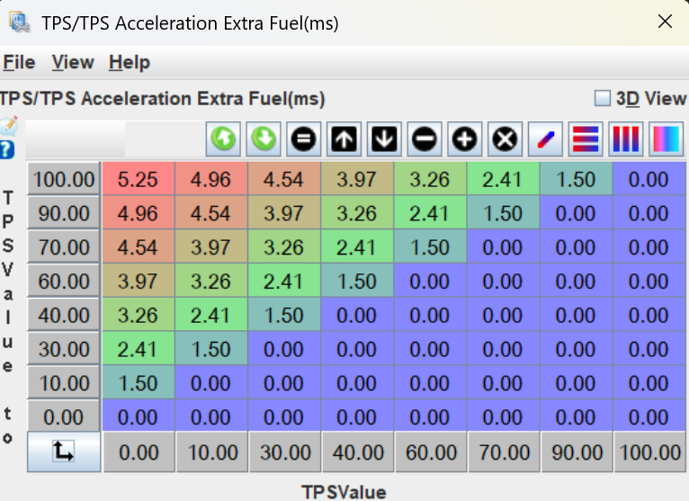

# TPS Based Acceleration Correction

There are three menus for TPS-Based Acceleration Correction, including __Accel/Decel Enrichment__, __TPS/TPS Acceleration Extra Fuel__ and __TPS/TPS AE RPM Correction__.

## Accel/Decel Enrichment

### TPS/TPS

These settings control the activation of the TPS/TPS enrichment. TPS/TPS enrichment enriches the fuelling based on how quickly the TPS increases, where it started, and where it ends. A small blip will trigger a small enrichment and a large blip will trigger a large enrichment. 

- __Length__: How long to look back for events that will trigger TPS-based acceleration enrichment. Increasing this time will trigger enrichment for longer when a throttle position change occurs as the strategy can "look back" over a longer period of time. The delta is determined by comparing the minimum TPS to the maximum TPS value across all events in this time period. See variable _Fuel: TPS AE change_ for the delta value.
- __Accel Threshold__: Minimum delta of TPS over the time period specified by _Length_ to activate acceleration enrichment. Actual TPS change has to be above this value in order for TPS/TPS acceleration to kick in. The actual added injection pulsewidth for accel enrichment is handled by the _TPS/TPS Acceleration Extra Fuel_ table.
- __Decel Threshold__: Maximum change delta of TPS percentage over the time period specified by _Length_. Currently not used as the Decel Fuel Enleanment Coefficient (_tpsDecelEnleanmentMultiplier_) is not exposed in TunerStudio.

### Accelerator Pump Model

The accelerator pump model is a more simple form of enrichment that acts like a digital version of an accelerator pump on an old school carburetor. When the throttle is stabbed, the pump on a carburetor adds an immediate shot of fuel to combat the brief lean spike. This model does the same and is controlled by the following settings below. 

Note that the accelerator pump model is to be used as a substitute for TPS/TPS enrichment, not with it. A user may choose to use the pump model over TPS/TPS enrichment as it is simpler. In this case, the __Length(sec)__ setting or __TPS/TPS extra fuel__ table need to be set to zero. Similarly if the pump model is not to be used, the fraction settings should be set to 0.

- __Fraction Period__: How many engine crank shaft cycles will the fuel enrichment last for. Like all enrichment tuning, the duration should be increased to find a balance where it is rich enough to minimise the lean spike on blip but not too rich to cause bogging. 2-10 cycles is a reasonable starting range, start small and gradually increase.

- __Fraction Divisor__: How to divide the fuel among the cycles, either all at once or tapering down to zero. A value of 1 will deliver the entire fuel shot in 1 cycle. Increasing the divisor will increase the length of the fuel as it tapers dow. For example, a value of 1.5 will deliver 66.7% in the first cycle, 22.2% in the second, then 11.% and 2.5% and so on. A value of 2 will be distributed as 50%, 25%, 12.5%, 6.25% and so on. Values of 1-10 are reasonable and should be experimented with.

## TPS/TPS Acceleration Extra Fuel

This is the main table controlling the AE. When enrichment is triggered by a blip, the amount of fuel is determined by taking the initial TPS position on the X-axis, the final position on the Y-axis, and the corresponding extra fuel (in ms) to add. Both axis should start at 0 and taper to 100. There should be no enrichment on or below the diagonal from (0,0) to (100,100). The enrichment should be most heavy in the top left and taper down towards the diagonal. The exact ms of fuel will change for every injector size but generally 2-10ms is a reasonable range. You can look at a data log to observe the normal range of pulse widths your injectors operate at to get a basic idea of acceptable ranges.

To tune this table, start by blipping the engine at idle using different TPS ending positions. You're looking for a crisp blip and a minimal lean spike (but a small lean spike is acceptable). Don't sacrifice a crisp blip for a stable AFR during a blip as that will likely be adding excessive fuel and cause bogging. Tune the maximum and minimum values of the first column and linearly interpolate them until the blipping from idle is smooth. Next, copy and transpose this column to become the top row of the table. For all other columns, set the lowest AE cell the same as cell (0,10) and linearly interpolate. The table should look symetrical about the top left to bottom right diagonal like shown below. The cells may need to be varied from symetrical although that is a good starting point.

## TPS/TPS AE RPM Correction

As engine RPM increases, the amount of fuel needed to mitigate the lean spike caused by a throttle blip decreases. Without decreasing the amount enrichment with RPM, a car tuned to blip perfectly from idle may bog when blipping at higher RPM. The correction takes the AE value from the __TPS/TPS Acceleration Extra Fuel__ table and multiplies it according to the RPM. 

The easiest way to tune this table is to set the multiplier at 1 for the maximum idle RPM and start by linearly reducing it to 0 at redline. After dialling in the __TPS/TPS Acceleration Extra Fuel__ for blips starting from zero throttle, hold down the accelerator at a higher RPM and try a range of different sized blips. If the car bogs, decrease the multiplier around that RPM range. The table may move from a linear drop to an exponential decay shape.