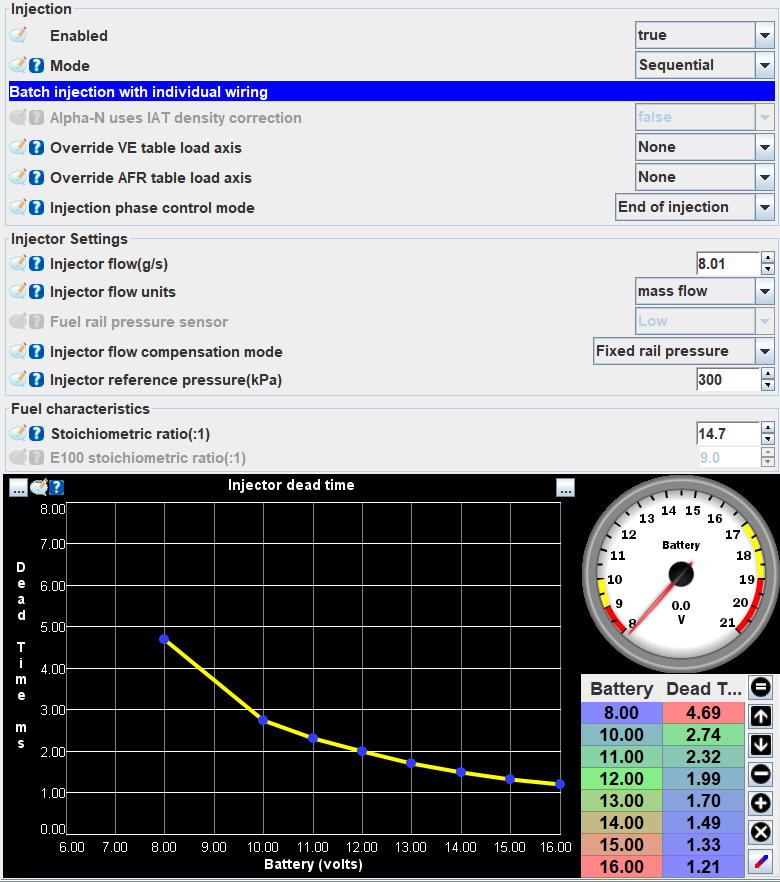

# Injector Configuration

This page describes the injection configuration settings and how to set up a set of injectors. Most FOME base maps are for the OEM injectors for that vehicle, e.g. a Miata base map is configured for the stock Miata injectors. Any modifications the the injectors will require the settings to be changed. Injector settings are crucial to be set up correctly for the rest of the tune to function correctly. It is highly recommended to flow test any new injectors before installing them, or at the very least finding their data sheet to work off of or data from another user who has them running. The closer the data in the configuration is to the actual injector performance, the better the results will be.

## Injector Configuration Settings

Below is the Injection Configuration dialog box. The following sections will cover the settings in this menu.

### Injection

Setting _Enabled_ to true is generally a good place to start. The injection mode has 4 settings:

- Simultaneous: This fires all injectors at once and wastes quite a lot of fuel. It has some applications, but most modern EFI engines don't use it.
- Sequential: This fires one injector at a time which is what most engines will use. Make sure your firing order is set correctly under _Base Engine > Base Engine Settings_ otherwise the engine may still run but will be spraying on closed valves which reduces atomization.
- Batch: This fires a set of injectors at once. On a 4-cylinder engine, this will fire one injector during one piston's intake stroke and another injector during another piston's exhaust stroke. At lower engine revs, batch injection does waste some fuel however at higher revs, both sequential and batch injection spray on closed valves as there simply isn't enough intake valve duration to spray the required amount of fuel.
- Single Point: Single point is used when one injector fuels all cylinders, similar to a single carburetor engine where one jet supplies fuel to all cylinders. In fact, single point is mostly used for converting older carburetted cars to EFI where the carburetor can be swapped for an EFI conversion kit.

Next up is _Override VE/AFR Table Load Axis_. For most EFI engines, set these to none as the axis defaults to MAP. The main time to change these to throttle position (TPS) is for a car with individual throttle bodies where a MAP sensor isn't fitted or is fitted but is giving inconsistent readings.

_Injection Phase Control Mode_ controls whether the start, end, or center of an injector on/injecting-phase corresponds with the Injection Phase Table (to be discussed later). Most commonly, end of injection is used here; E.g. if the injection phase is 400 degrees (720 degrees in a complete 4 stroke combustion cycle), the injector will have finished spraying fuel at precisely 400 degrees.