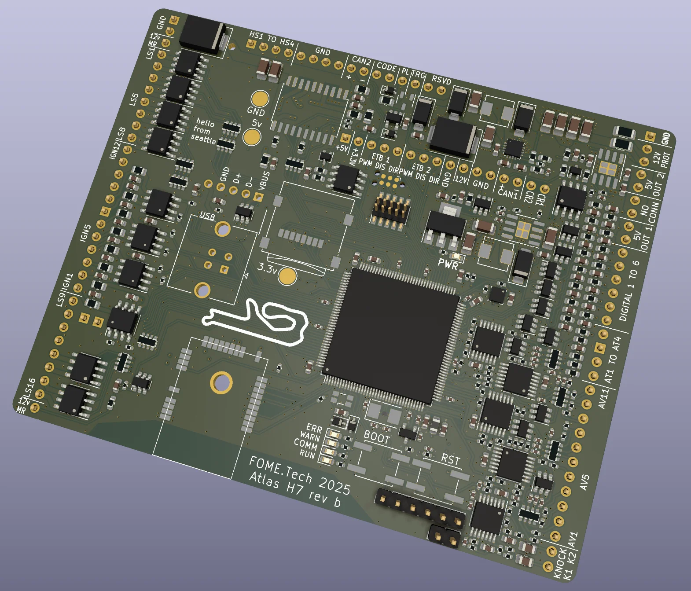

# Atlas
ECU brain module for the open source FOME ECU firmware.

# System:

- 480 MHz + 1MB RAM high performance CPU
- Lots of room for large user Lua scripts!
- Integrated (optional) WiFi connectivity
- SD card for self-contained data logging (accessible over USB)
- 2x CAN up to 1mbit/s (hardware supports CAN FD, no software support yet)

# Inputs:

- 11 Analog voltage inputs
- 4 Analog temperature sensor inputs with internal pull-up resistor
- 8 Digital inputs with integrated pull-up
- 2 Knock sensing inputs
- Onboard barometric pressure + temperature sensor

# Outputs:

- 12 Low side outputs (injectors, solenoids, relays, etc)
- 12 5v push-pull ignition outputs (directly drive smart coils or IGBT for dumb coils)
- 4 12v High side outputs
- Logic-level outputs for 2x electronic throttle (ETB/DBW), driver chips on ECU base board
- 4 Logic-level outputs for extra output drivers on the ECU base board

# Where to Buy:
[🇺🇲 HappyCactusGarage](https://happycactusgarage.com/products/fome-atlas-ecu-brain-module)

