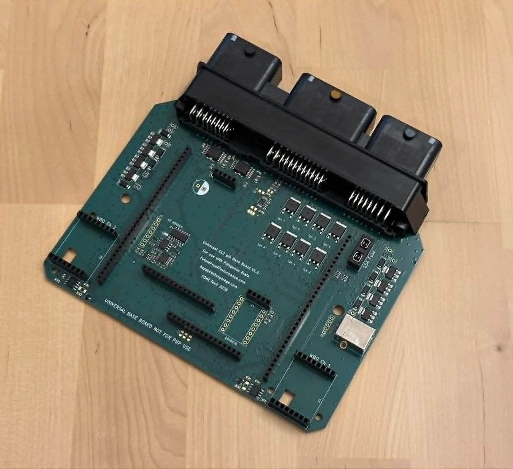

# Universal 112

This is our Wire-In open-source ECU base board compatible with Polygonus and Atlas ECU brain modules. It uses the Molex 112-pin connector. Inteded for custom wiring harnesses or OEM harnesses where you will cut and replace the original connector.

## Features

### Data and Communication

- USB-B
- Dual CAN bus

### Inputs

- Dual wideband O2 sensor controllers using open source module (connected internally to CAN bus #2)
- Dual VR crank/cam sensor inputs. VR input 2 uses adjustable threshold, suitable for low tooth count (single tooth cam, etc) applications (LS12 unavailable if used)
- 11x Analog voltage Inputs (Weak pulldown to ground to avoid floating)
- 4x Analog Temperature inputs (2.7k pullup resistor to 5v)
- 6 digital inputs with integrated 2.7k pullup resistor to 5v. *Use for hall cam/crank sensors, switches, etc.)

### Outputs

- 2x Electronic Throttle Body H-bridge drivers.
- 20x Lowside outputs (LS1-16), 8 with freewheel diodes (LS9-12 and, optionally, IGN9-12)
- 8 logic level ignition outputs (IGN1-8)
- 8 ignition "dumb coil" IGBT drivers (IGN1-8, shared function with logic outputs, independent output pins)
- Stepper motor driver for stepper idle (LS9/10 outputs unavailable if used)

### Github 

- [Github - Universal 112](https://github.com/FOME-Tech/Polygonus-Universal-112)

### Connector 

- [Universal 112 Pinout](../Universal-112-Pinout)
- [Universal 112 Connector Reference](../Universal-112-Connectors)

### Case 

- [Univeral 112 Case V1.0 by OrchardPerformance - Github](https://github.com/FOME-Tech/Polygonus-Universal-112/tree/main/CAD)
- [FOME Polygonus-Universal-112 Case by MW - Printables](https://www.printables.com/model/1798637-fome-polygonus-universal-112-case)

### Buy

- [🇺🇲 Happy Cactus Garage](https://happycactusgarage.com/products/fome-universal-ecu)
