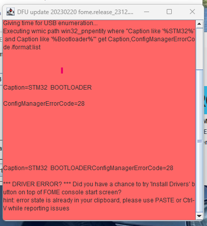
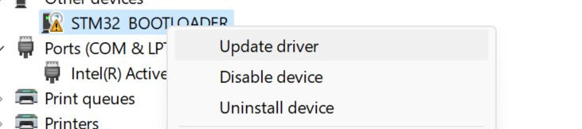
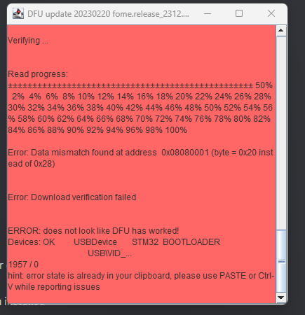
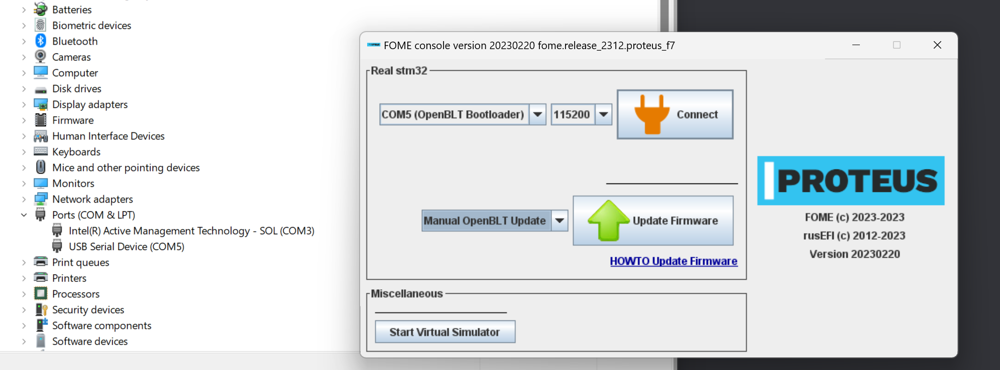
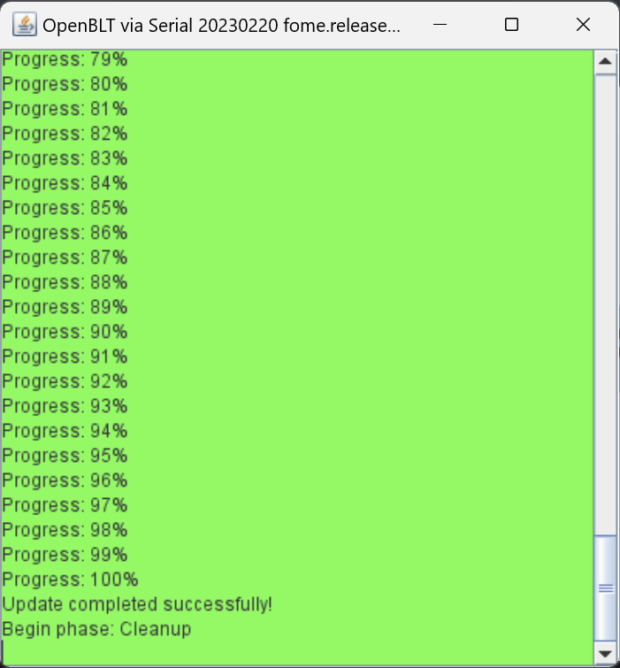

# Flashing Software Notes

:::note

Some boards, notably those with processors utilizing certain dual bank memory layout, like the STM32F7, suffer from an
issue such that flashing does not succeed correctly, due to an error with the erasure mechanism.  For these situations,
manually erase the flash memory before flashing; i.e. perform a full/mass erase procedure first.

:::

While the FOME console is the recommended and officially supported way to update FOME firmware on supported boards,
other mechanisms exist to flash firmware to board supporting FOME.  These tools are also useful in odd situations, like
the event of a firmware update/flash failure, or some other firmware corruption issue, such that FOME console nor
TunerStudio recognize the ECU when connected.

For the ECU, you will need to access buttons or pins on the main board to force the processor into bootloader/DFU mode.
Some boards use a momentary button, likely near to the reset button, to force this mode during power-up.  Others might
use a set of pins or pads that need shorted to force this mode during power-up.  Press the button or short the pins with
the ECU disconnected from the computer, then simultaneously connect the ECU into the computer.  Once connected, the
button can be released or the short removed.

## STM32CubeProgrammer

STM32CubeProgrammer is an officially STMicroelectronics supported tool to flash STM32 processors.  Information about
and how to download and install the tool can be found on [the STM
wiki](https://wiki.st.com/stm32mpu/wiki/STM32CubeProgrammer).

In STM32CubeProgrammer, select the *USB* tab on the right and refresh the port in the right side menu until a DFU is
detected. Click *Connect* to connect the ECU to the programmer. Click the *Read* button to read the device memory and to
validate that the ECU is connected.

Once validated, choose the *Open File* button and load the file marked *fome.bin* within the firmware bundle downloaded
earlier. This is a binary file containing the ECU firmware. Now choose the *Download* button to write this firmware to
the ECU. Give it up to several minutes to download and once the status console confirms successful download, disconnect
from the programmer then unplug the ECU and plug it back in. The ECU should now connect to the computer and TS normally
again.

## dfu-util

dfu-util is a free software tool to flash Device Firmware Upgrade (DFU) compatible devices, including STM32 processors.
It supports most popular operating systems, including MacOS and Linux.  Information about dfu-util can be found on [the
dfu-util website](https://dfu-util.sourceforge.net/).

Updating with dfu-util is as straight-forward as invoking it like so:

```sh
dfu-util -v -d 0483:df11 -a 0 -D fome.dfu -s :leave
```

Note that the `:leave` option does not always work, which would otherwise automatically instruct the processor to leave
DFU mode and load the firmware; the board must be manually reset to load the flashed firmware.

To erase a device, use the following invocation:

```sh
dfu-util -v -d 0483:df11 -a 0 -s :mass-erase:force
```

## Troubleshooting updates prior to release FOME 2312

If an error occurs during the DFU update for release 2312 a manual driver update may be required. This may be the case if the ECU is not yet using the OpenBLT bootloader implementation.

When FOME console prompts with a "ConfigManagerErrorCode=28", proceed by opening Device Manager. Look for the device named "STM32 BOOTLOADER"; it may be under "Other Devices".



Right click the STM32 BOOTLOADER device and select "Update driver" from the context menu.



Select "Browse my computer for drivers" and proceed to browse and have Windows update the drivers for STM32 BOOTLOADER by directing it to "../drivers/silent_st_drivers/" directory, which is extracted from the ".../drivers/silent_st_drivers2.exe" archive.

Then, unplug the ECU and retry the firmware udpate from FOME console.

Other DFU update errors may occur, such as "Data mismatch found at address" or "looks like ECU didn't reboot to OpenBLT."



Again, unplug the ECU and retry the firmware update. At this point, FOME console should have detected the ECU as "OpenBLT Bootloader". Proceed by updating the firmware via "Manual OpenBLT Update."



If prompted with "Update completed successfully!", proceed by power cycling the ECU. From this release onwards the ECU can be updated using OpenBLT and should not require any manual driver installs.


