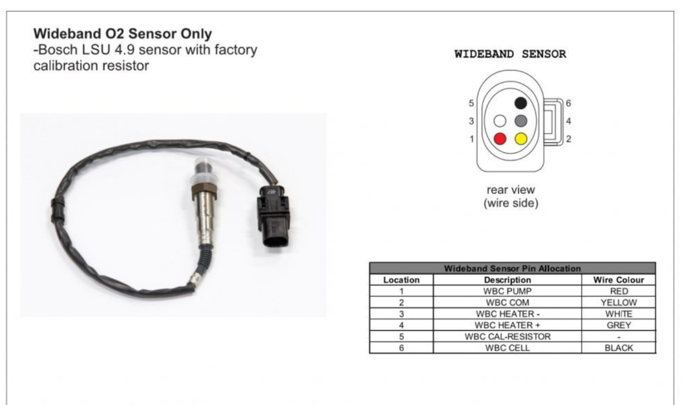
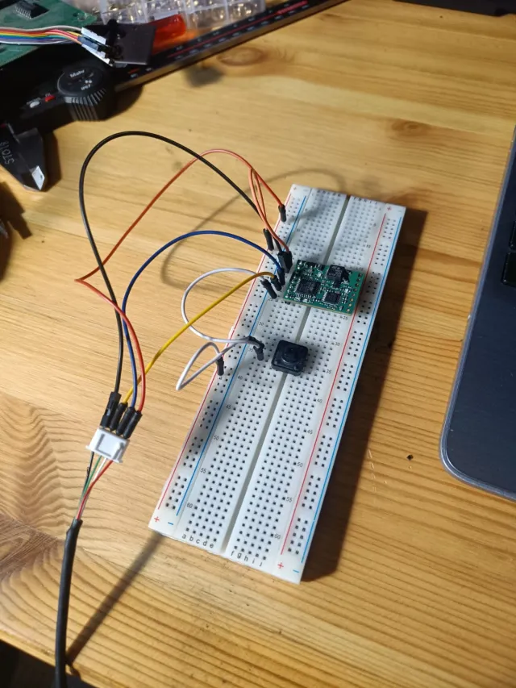

# Wideband Oxygen Sensor Configuration Guide

This guide explains how to set up and configure a wideband oxygen sensor with a FOME wideband controller.

## Overview

Wideband oxygen sensors are required for accurate AFR measurement. Unlike narrowband sensors that only indicate if the mixture is rich or lean, wideband sensors provide precise AFR readings across a wide range.

## Sensor Pinout Reference

### LSU 4.9 Sensor Pinout

|PinNumber|Function|Description|
|---------|--------|-----------|
|1|IP|Pump Current|
|2|VM|Virtual Ground|
|3|HEAT-|Heater Negative|
|4|HEAT+|Heater Positive|
|5|RT|Calibration Resistor|
|6|UN|Nernst Voltage|

**Note:** The calibration resistor is internal to the sensor. On the sensor connector, there are only 5 wires but 6 pins, as pins 1 and 5 have a laser-trimmed resistor between them.

### F042 Controller Module Pinout

| Pin Number | Function | Notes |
|------------|----------|-------|
| 1 | Ground | Connect to chassis ground |
| 2 | LSU Ip | Connect to sensor pin 1 |
| 3 | LSU Heater - | Connect to sensor pin 3 |
| 4 | LSU Heater + | Connect to sensor pin 4 |
| 5 | No connection | |
| 6 | 12v Supply | Connect to fuel pump supply or independent relay controlled by ECU |
| 7 | No connection | |
| 8 | LSU Vm | Connect to sensor pin 2 |
| 9 | LSU Rtrim | Connect to sensor pin 5 |
| 10 | LSU Un | Connect to sensor pin 6 |
| 11 | CAN H | CAN bus high |
| 12 | CAN L | CAN bus low |

## LED Status Indicators

| Blue LED | Green LED | Meaning |
|----------|-----------|---------|
| off | fast flash | Sensor warming up |
| off | slow flash | Sensor hot, operating normally |
| flashing | off | See error code table below |
| alternating | alternating | Bootloader, see below |

## Error Codes

When the green LED is off and the blue LED is flashing, this indicates an error. The blue LED will blink a certain number of times, with a 2-second pause, then repeat.

| Blinks | Meaning |
|--------|---------|
| 3 | Sensor failed to heat up within 30 seconds |
| 4 | Sensor overheated after entering closed loop mode |
| 5 | Sensor unexpectedly cold after entering closed loop mode (bad wiring?) |

## Bootloader LED Codes

| Blink pattern | Meaning |
|--------------|---------|
| alternating slowly | Firmware integrity check failed, please retry firmware upgrade |
| alternating quickly | Waiting for bootloader entry command, only occurs for ~1 second before launching firmware |

## Initial Setup

### Firmware Installation

If ordering from somewhere like JLC, wideband modules require one-time initial programming

#### DFU Method (Standalone WBO2)

For standalone units without a programmer, use the DFU (Device Firmware Upgrade) method:

1. Connect USB directly to the board (5V, GND, DATA+, DATA-)
2. Pull BOOT0 to 5V during power-up to enter DFU mode
3. Make sure the transceiver isn't connected (connector PCB), otherwise USB won't work
4. Use STM32Cube software to flash the firmware (ST Link utility may not work)

Download firmware binary from: [mck1117/wideband Releases on GitHub](https://github.com/mck1117/wideband/releases).

## Common Issues and Solutions

### Extension Cable Issues

When using extension cables, ensure all pins are connected. Some aftermarket extension cables (like certain Innovate models) may omit the calibration resistor pin (Pin 5/RT).
