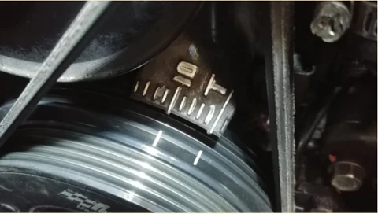
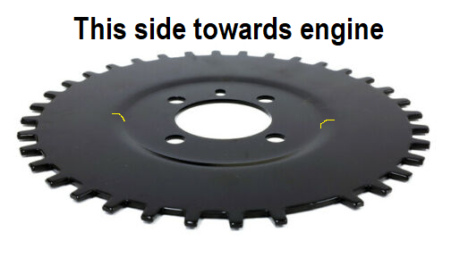
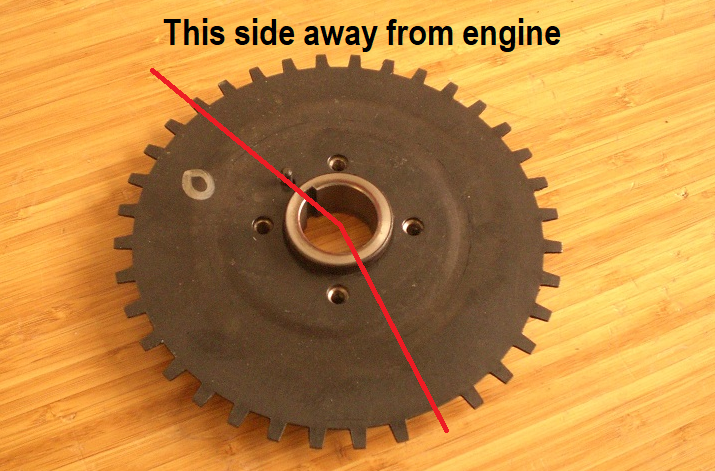
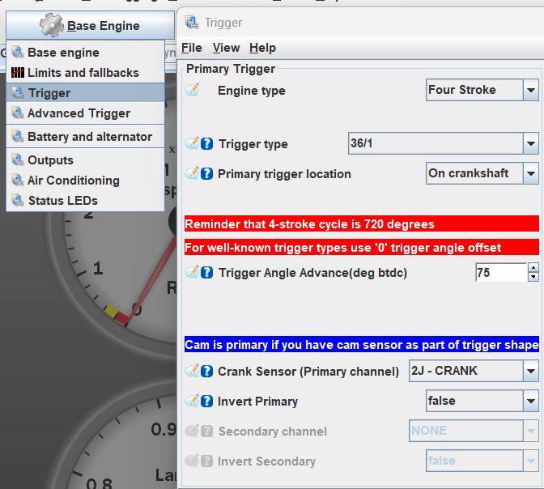

# Miata 36T Trigger Wheel Installation

A trigger wheel with more teeth on the crankshaft provides a finer resolution of the crankshaft position signal. This finer resolution enhances timing control, reduces signal noise and vibration, and improves performance, especially at high RPM. Overall, it contributes to better engine stability and drivability, making it particularly beneficial in high-performance or racing scenarios.

For Miatas, there are a range of upgraded trigger wheels available, most with 35 or 34 teeth referred to as a 36-1T or 36-2T trigger wheel. The triggers nominally have 36 teeth and either one or two teeth are removed so the crank position sensor will receive a signal when the crank has completed a full rotation.

The trigger wheel recommended for BMM ECUs is the 1999-2001 Mazda Protege 36-1 Trigger Wheel (part # ZM0111408). This trigger wheel is compatible with the stock crankshaft pulley and a Fluiddampr crankshaft pulley. If using an ATI damper, you must purchase a compatible trigger wheel.

## Installation

Before completing this installation it is recommended to have the car running on a BMM ECU with the stock trigger wheel. This way, only a few parameters in the tune need to be changed to get the car working with this part.

### Disconnect the Battery

Ensure the engine is off and disconnect the battery for safety.

### Remove Engine Belts

Remove the engine belts obstructing access to the crankshaft pulley. Typically, there are two belts: the accessory belt which drives the power steering and A/C and the alternator belt which also drives the water pump. The belt tensioners are respectively located on the power steering pump (top right on the engine from the front) and the alternator (bottom left). With the belts removed, you should have clear access to the crankshaft pulley.

### Rotate Engine to Top Dead Center (TDC)

Using a 21mm socket on the bolt in the centre of the crank pulley, rotate the engine clockwise until the marks on the crank pulley line up with the timing marks on the timing belt cover.

### Remove the Crankshaft Pulley

Remove the crankshaft pulley by undoing the four 10mm bolts on the front. The large centre bolt doesn't need to be removed if using the stock or a Fluiddampr pulley. An ATI damper will require removal of the crankshaft bolt to install so consult their installation manual if required. Behind the pulley should be the OEM trigger wheel. Go ahead and remove it, put it in the bin or use it as a beer coaster.

### Install the New Trigger Wheel

The new trigger wheel can go on to the engine in two orientations, correctly and backwards. To radially align the trigger wheel, there is a dowel pin on the crank which slots into a hole in the trigger wheel. At TDC, the dowel pin should be vertical or at the 12 o'clock position. The correct orientation is to put the trigger wheel on, as per the diagrams below, with the centre recessed part of the trigger pointing towards the crank, the white dot facing outwards and the missing tooth at approximately the 7 o'clock position when the engine is at TDC and the dowel pin is vertical. The trigger wheel is the wrong way around if the teeth are further forwards of the engine than the centre recces, the white dot is facing towards the engine, or the missing tooth is at the 5 o'clock position at engine TDC.

If installing an ATI damper and trigger wheel or a Fluiddampr, consult the manual as the installation has several additional steps which include bolting the trigger wheel to the aftermarket crankshaft pulley damper. In the case of a Fluiddampr, the orientation of the Mazda 323 trigger wheel will be identical to installation onto a stock pulley.

### Re-Install Crank Pulley and Adjust Crank Sensor

Re-install the crank pulley and the four 10mm bolts (109-151 inch/lbs 13-17 Nm). Check the clearance between the crank sensor and the tip of a tooth on the timing wheel, there should be a 0.5-1.5 mm or 0.020-0.059 inch gap between the tooth and the sensor. If you later come up with trigger errors, this gap may need to be reduced. To reduce the gap, loosen the 10mm bolt holding the crank sensor and wiggle it to the desired position.

### Re-Install Belts and Connect Battery

Re-install the accessory and alternator belts checking they are suitably tight. Now connect the battery back to the car. The mechanical installation is now complete and it's time to boot up the computer.

## TunerStudio Settings

In the "Trigger" menu under the Base Engine tab, change the trigger type to 36/1 and the trigger angle advance to 75 degrees.

If using a 36-2 trigger wheel instead, the first setting would be 36/2 and the advance will likely be different so check with the manufacturer. In the case of a 36-2T trigger wheel for an ATI damper, the advance angle should be around 148 degrees.

These settings will likely get the car started with the Mazda 323 timing wheel however the trigger angle advance may need to be iterated to perfectly match the timing on your car. To check or set the base timing, set the timing to fixed in TunerStudio and use a timing light on the crank to measure the timing. If the timing is not 10 degrees BTDC, iterate the trigger angle advance in TS until it is spot on. This is covered in "Set Base Timing" within the [Miata Quick Start Guide](../Miata-MX5-Quick-Start).

Now after ensuring your timing is reverted back to dynamic in TS, the installation should now be complete!
