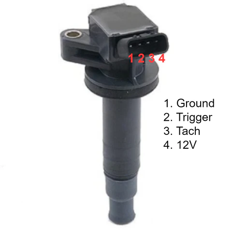
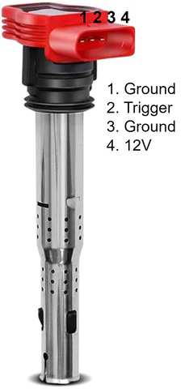
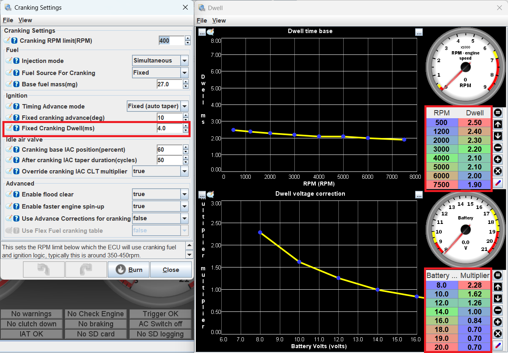

# Miata Coil On Plug Conversion

Converting your Miata to run a coil on plug (COP) ignition setup is a great engine upgrade for those with forced induction or high-performance engines. Offering a stronger spark and improved reliability, coil-on-plug technology outperforms the coil packs of the 1990s and early 2000s Miatas. It also eliminates the need for ignition wire replacements and reduces electrical interference, making it a more robust and appealing option in automotive applications.

This guide will discuss the steps to convert your stock NA or NB Miata ignition system to COP. 

## Parts Required

### Ignition Coils and Connectors

Toyota and Audi/VW ignition coils are the most common. For Toyota coils, ones off a 1ZZ engine will work as well as many other variants. Some part numbers for Toyota coils are: 90080-19015, 90919-02239, 90080-19023, 90919-02234. The part number for the coil connector is: 90980-11885.

For Audi coils, the ones used are referred to as R8 coils as they are used on the Audi R8 (as well as most other Audi's and some VWs). The most common part number is: 06E905115G however there are also many variants that will work depending which brand of "R8 coil" you want and how much you want to spend. The part number for the R8 coil connector is: 1J0973724.

Both of these ignition coils work and both have their distinct advantages. The R8 coils securely clip onto the spark plugs however they protrude further from the spark plug holes than stock so usually require a form of spacer to keep them from wiggling around. The Toyota ones sit flusher however they also require a bracket for their mounting bolt to secure them in place. For the NA6 and earlier NA8 cars, the tachometer takes a signal from the ignition coils, only the Toyota coils have this pin. You can run R8 coils on these cars however your tachometer will not work unless you wire it directly to the ECU.

### Car Wiring Harness Connectors

If you wish to solder directly to the harness, you can ignore this however those wishing for a more elegant solution prefer to clip their COP harness onto the existing vehicle harness. 

For a 1.6L, this is more difficult and it is either recommended to buy a spare igniter to take apart or simply wire directly into the harness. 
For the other NA and NB Miatas utilizing a coil pack on the back of the valve cover, a compatible connector part number is: 6098-0144.

### Other Components

- 10,000uF capacitor to be installed between the 12V and GND which helps to filter electrical noise however this is not strictly necessary.
- 18-22 AWG wire to help reduce the internal resistance and carry the power to drive the coils.
- Wiring harness or electrical tape to wrap over the harness
- Crimping tool
- Soldering equipment
- Heat shrink
- Wire strippers
- Wiring
- The wiring diagrams for each model NA/NB is shown below.

#### NA6 (1.6L)

#### NA8 94-95 (1.8L)

#### NA8 95+ /NB1 (1.8L)

### Toyota Coil Pinout

From left to right on the coil is the ground, ECU signal, tachometer signal, and 12V. For later NA8 and NB1 Miatas, the tachometer signal does not need to be wired up.

### R8 Coil Pinout

From left to right on the coil is the ground, ECU signal, ground, and 12V. The two grounds can be connected together. Note that the R8 coils have no tachometer signal meaning that on NA6 and early NA8 cars, the tachometer will need to get its signal from the ECU. Later NA8s and NB1s do not have this issue.

### COP Harness

To make the neatest harness, cut the wires to length with the coils installed in the car in their desired orientations. Leave a small amount of excess so there is no tension on the wiring harness and room in case a wire needs to be re-stripped. Make sure to cover each exposed solder joint with electrical tape or heat shrink then go over the entire harness with tape to protect it. It is recommended to check your harness wiring several times for shorts or mistakes before powering on the car.

## Coil Mounts

For both coils, there are a range of third-party suppliers selling mounting brackets. If you wish to DIY a mount, they can be made relatively inexpensively using aluminum or 3D printed spacers (ABS or other high temperature plastics are recommended).

## ECU Dwell Time Setup

The dwell times need to be modified in TunerStudio before starting the car with the new COPs. Recommended safe dwell settings are shown below for both Toyota and R8 COPs. Note that dwell times can vary significantly between different ignition coils and it is recommended to do some additional research on your specific coil. The longer the dwell time, the longer the coil charges for and the stronger the spark. Too little dwell will result in a weak spark and too much dwell can draw an excessive amount of current, possibly melting the coil.

