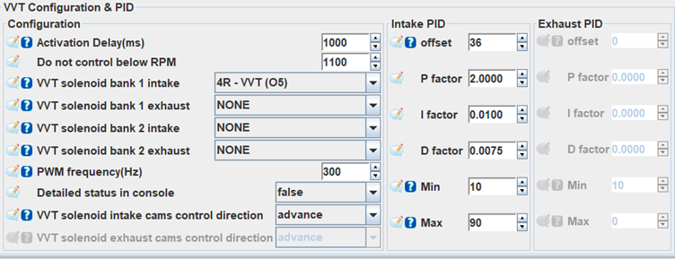
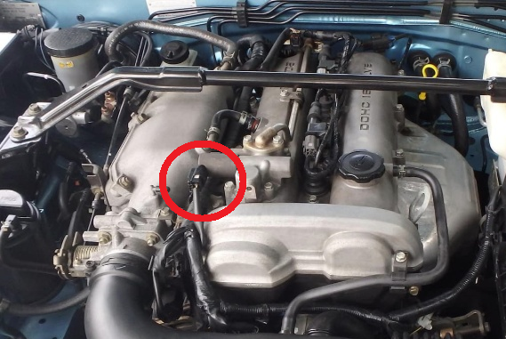
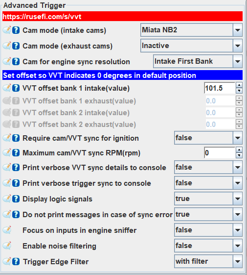
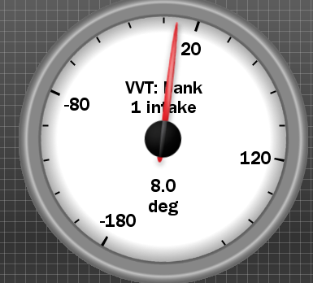
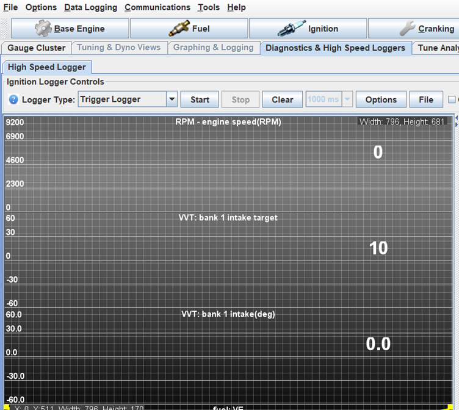
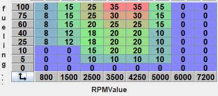

# Miata VVT Setup and Tuning

Tuning the NB2 BP-Z3/BP-VE VVT motor can be a daunting task. This guide will detail the process for configuring and tuning the VVT for an NB2 VVT motor using a BMM ECU. 

## Required Equipment

- Vehicle running an NB2 VVT motor.
- Access to a dyno or a safe location to tune the vehicle using Virtual Dyno. An actual dyno is preferable to virtual dyno due to the accuracy of readings and ability to safely vary the operating point of the engine.
- Laptop with TunerStudio, MegaLog Viewer and optionally Virtual Dyno installed.

## Initial TunerStudio Configuration

Open TunerStudio and open the "VVT Configuration and PID" menu under the advanced tab. Going down the settings in this menu first is the activation delay. This is the initial delay when the car is started before the VVT is enabled. A setting of 1000-5000ms (1-5s) should be suitable here to give the engine enough time to build oil pressure before enabling the VVT.

The "Do not control below RPM" setting or activation RPM disables VVT until the engine RPM exceeds this value. Ideally set it about at 100-200 RPM or so above your idle RPM to keep it disabled during idle. This will simplify the idle tuning as the engine torque from the VVT changing can lead to a fluctuating idle.

For the VVT solenoid banks, an NB2 motor only has VVT on the intake so select the pin labelled as "VVT" for the "VVT solenoid bank 1 intake" setting.

On the right side of the menu are the PID control options. If you are new to PID tuning, plenty of guides exist detailing how it works. [This video by RCModelReviews](https://youtu.be/0vqWyramGy8?si=oALUmrArWDNi7Scp) details how PIDs work on a basic level.

Pictured below are some reasonable default settings however it is still recommended to configure the settings yourself as settings can vary from car to car.

## VVT Offset Setting

Before configuring the VVT PID, the basic VVT angle offset needs to be configured. This is to calibrate what the ECU thinks is 0 degrees VVT angle to the actual VVT angle on the car, similar to setting the base timing. **This is different to the offset in the PID control menu**.  Open the "Trigger" menu under the "Base Engine" tab and locate the "VVT offset bank 1 intake(value)" setting. In the engine bay, unplug the VVT solenoid highlighted in the image below:

 Right click one of the gauges on the background of TunerStudio and under VVT, change it to "VVT bank 1 intake vvtPositionB1IGauge". This will show a live reading of the detected VVT position on the car. 

Start the car with the solenoid unplugged and read the VVT position on the gauge. Change the "VVT offset bank 1 intake(value)" setting until the VVT position reads 0. The VVT angle is now calibrated and you can shut off the car and plug the solenoid back in. Your offset should be similar to that shown below:

## PID Tuning VVT Settings

Under the PID settings the offset is the VVT solenoid duty cycle offset. Basically, the solenoid will only activate if it is pulsed above a threshold duty cycle and the PID controller needs to know what duty cycle this occurs. PID tuning can be a tedious process and it is recommended to outsource it to a professional if you are not confident.

To tune the offset, open the "VVT Closed Loop Target" table and set every cell to a constant value such as 10 degrees. Set the P gain to 1. Right click one of the gauges on the background of TS and under VVT, change it to "VVT bank 1 intake - vvtPositionB1IGauge". This will show a live reading of the detected VVT position on the car.

Start with an offset value of e.g. 10. Start the car and hold the engine RPM at a constant value above the threshold RPM and observe the VVT position gauge. If the gauge does not change, increase the offset by 5-10 and repeat until you find the minimum offset required for the gauge to change VVT position. Note that the actual VVT position won't be correct yet as the PID controller still needs to be set up. A value in the range of 30-40 is expected.

Next is the PID tuning. This step can take a while and is important to do thoroughly to ensure that the VVT can reach its target angles quickly and without overshooting significantly. The PID tuning is best done on a dyno or with a mate to drive the car whilst you tune it. Alternatively you can take a driving datalog, analyze it in MegaLogViewer, revise the PID settings and take another driving log. This method would be very time consuming and the first two are recommended.

To tune the P, I, and D settings you can either start from scratch or work from other users values to refine them. Below are some PID values you can work from if you wish. The process of tuning the PIDs is to put various angle targets in the VVT intake target table at different engine loads and RPM and to move the engine around between them. As the VVT target changes, the PID loop will activate to attempt to reach the new target. By watching the response of how quickly and with how much overshoot the controller reaches the target, the PID controller can be tuned. 

An example on the dyno this might look like having all VVT target cells below 1500 RPM at 0 and above that at 20 degrees. In the "diagnostics and high speed loggers" tab you can set one graph to be the VVT position and the other as the VVT target as shown below:

Next, rev and hold the engine up to e.g. 2000 RPM and watch how quickly the VVT position rises to match the VVT target. If the position overshoots, decrease P or increase D, vice versa if it undershoots. If the position slowly drifts from 20 degrees, you would increase the I gain. The PID settings would be varied until the VVT position quickly rises or falls to and VVT target changes without much over or undershoot. To properly optimize the PID tune, it is recommended to repeat a similar tuning process with lots of VVT angles.

Once the VVT is PID tuned, the VVT target table can be tuned.

## VVT Target Angle Tuning

Tuning the VVT angle is where the power gains are made. At this point the VVT should be fully set up and PID tuned to quickly reach the target position. If you cannot be bothered tuning the VVT angle, copying another users settings may yield decent results provided they have done the proper tuning however there will always be slight variances from car to car. A reasonable target table example is shown below:

The target angle is tuned in two sections, ramp run tuning and steady state tuning. Ramp runs are used to tune the VVT at maximum throttle and steady state tuning is used to tune the angles for partial throttle applications when the engine isn't fully loaded. This tuning is best done on a dyno for the best accuracy.

To tune the ramp run, set the entire VVT target table to 0 and perform a run. Save this run and do another, this time incrementing the whole VVT target table angle by 5-10 degrees depending how many dyno pulls you want to do. Repeat this process until the maximum VVT angle of 44 degrees is reached. Now load up all of the dyno runs and overlay them on top of each other. There will be points across these graphs where the torque from one VVT angle rises above the others. Power can be used as well but it is easier to do the tuning using the torque plots. For a given RPM range, take the VVT angle with the highest torque and put that into the maximum load section of the VVT target table. Repeat this for every RPM range where a different VVT angle yields a higher engine torque until the maximum load row of the table is populated. An example ramp run dyno graph is shown below where there are several "dyno runs" at different VVT angles. The yellow lines indicate the crossover points where a certain VVT angle has the most torque. Simply set the highest torque producing VVT angle in the chart for a given RPM range to that in the target table.

If you have some way of maintaining a constant throttle position below 100% such as a chock under the pedal (**on the dyno only!!!**) or limiting the maximum throttle body travel, ramp runs can be used to efficiently populate the whole VVT table for conditions where the engine isn't fully loaded.

To steady state tune on a dyno, the dyno will hold the engine at a specific RPM and load so you can vary the VVT angle in real time to see which angle has the highest torque. You then move to another cell and repeat this to tune the lower engine load sections of the VVT target table. To save time, it is possible go along a row tuning every second cell then interpolating between them. The downsides to steady state tuning is the higher load and RPM will quickly heat up the engine so it is crucial to monitor the temperature. This method also takes quite a lot of time but will yield precise results as the angle can be varied in small increments as the torque is measured instantaneously. 

Road tuning with steady state is not possible as there is no way to measure the torque of the engine as the car sits at a specific load and RPM.