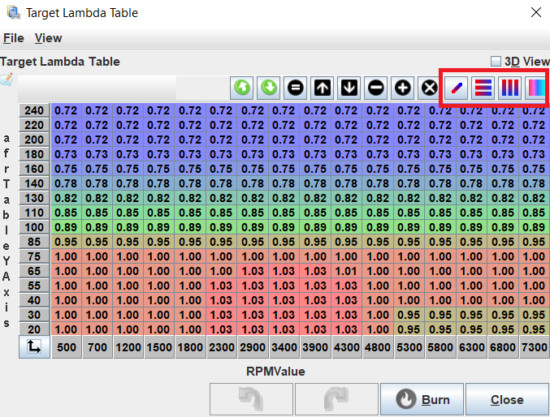

# Air Fuel Ratio

Air fuel ratio or AFR refers to the mass ratio of air to fuel involved in a combustion cycle. The AFR is important as the amount of fuel injected into the engine is one of the most significant combustion parameters that the ECU can control.  The ECU takes the target AFR and determines the correct mass of fuel to inject based on the mass of air approximated using the temperature and pressure.

## Why AFR Matters

An engine operates most efficiently and cleanly when the air-fuel ratio is at a specific value called the stoichiometric ratio. This ratio depends on the type of fuel being used, but for gasoline, it is approximately 14.7 parts air to 1 part fuel (14.7:1). When the air-fuel ratio is at the stoichiometric value, all of the fuel is burned, and there is no excess oxygen or unburned fuel left in the exhaust. This results in the least amount of emissions and the highest fuel efficiency. If the air-fuel ratio is too lean (excess air), there is not enough fuel to burn, and the engine may misfire or stall. If the air-fuel ratio is too rich (excess fuel), there is not enough oxygen to burn all the fuel, and the engine may emit more pollutants, have reduced fuel efficiency, and may even cause damage to the engine over time. Therefore, maintaining the proper air-fuel ratio is essential for optimal engine performance, fuel efficiency, exhaust gas temperature, engine knock and emission control in a car engine.

## What is Lambda and Why it is a Superior Metric

Lambda, is a dimensionless ratio of the actual air-fuel ratio to the stoichiometric air-fuel ratio. In other words, it is the ratio of the AFR to the stoichiometric AFR (or the measured AFR divided by the stoichiometric AFR). Lambda is a more universal measure of the air-fuel ratio, as it is not affected by the specific fuel being used. The stoichiometric lambda value for any fuel is always 1.0, regardless of the fuel type. For example, if the actual AFR in an engine is 14.7:1 (stoichiometric AFR), then the lambda value is 1.0. If the actual AFR is leaner than 14.7:1, then the lambda value is greater than 1.0, and if it is richer than 14.7:1, then the lambda value is less than 1.0.

Lambda is preferred in engine tuning because it allows for a more precise control of the air-fuel ratio across different fuels and is generally easier to comprehend. For example, if a gasoline car is running 10% lean, the AFR would be 16.17 and lambda would be 1.1. If the car is 10% rich, AFR would be 13.36 and lambda would be 0.9. Looking at lambda, it is instantly obvious what percentage rich or lean the engine is running but with AFR, it requires more effort.

## AFR Targets - When to Run Rich, Lean and Stoich

The ideal AFR targets will vary for every engine however there are guidelines for what the targets should be for each operating zone of the engine. These targets will be represented on an AFR target table or map, shown below, which characterizes the various engine operating conditions for their respective engine RPM and MAP. Generally speaking, running richer will decrease engine response at a gain of extra combustion chamber cooling and slightly higher power to a point. Inversely, running leaner will increase engine response at a loss running hotter and reducing power.

### Idle and Cruising

For idle, a lambda of 1.0 is generally recommended to achieve a stable idle. When cruising, a lambda of 1.0 is also recommended however this can be raised up to about 1.05 to improve the fuel efficiency of the vehicle on the freeway or traveling a constant speed for long periods of time.

### Low and High Load Vacuum

In the low vacuum section of the map, the engine will only operate here when the engine is under minimum load such as rolling in gear with the throttle closed. To save fuel, the engine can be operated up to about 1.05 lambda here or Deceleration Fuel Cutoff (DFCO) can be enabled to disable to injectors entirely and let the vehicle engine brake. DFCO is found under the _Fuel_ tab in Tuner Studio.

The high vacuum part of the map is typically only used in the short period between high RPM gear changes or throttle lifts. The engine is usually being driven hard if this part of the map is being used so a target lambda of 0.95 to help cool the cylinders is recommended although a value of 1.0 is also acceptable.

### High Load Naturally Aspirated/Boost Transition Zone

For a naturally aspirated (NA) engine, this zone represents the peak operating load which the engine will be placed under. A lambda of about 0.9 is recommended to balance performance with cylinder cooling.

For a forced induction engine, this zone represents the engine's transition into boost. As the engine usually isn't under a lot of load here, a slightly higher lambda of 0.95 is recommended to balance the engine response with some degree cylinder cooling.

### Medium and High Boost Zones

When the engine moves into boost, the engine load increases as does the temperature and pressure of the combustion. Hence, as the boost pressure increases, the AFR needs to get progressively richer. A good starting point for about 200kPa MAP or 14.5PSI of boost is a lambda of 0.78-0.82. For 300kPa MAP or 29PSI of boost, a 0.76-0.8 is generally a good starting range. Of course, every engine will differ so it is important here to research what others have successfully run on similar platforms to you.

### Engine Start and Dead Zone

In both of these zones, their target AFRs do not matter a whole lot. The dead zone will never be operated in and the starting zone will never operate with closed loop fuelling as the lambda sensor will only activate after the car is running. The best configuration for these zones it to copy or transition them from the target AFR columns directly next to them for the sake of smoothness in the map.

### Merging the zones

On the AFR target diagram, certain operating zones have missing values. To properly select targets for these zones, it's recommended to interpolate and smooth out the values between the defined sections of the map. It's important to create a smooth AFR target map that avoids abrupt changes, as the engine requires gradual variations in AFR to function optimally. To smooth the map in Tuner Studio there are four buttons in the map shown below. From left to right, these buttons interpolate across the entire selected zone, interpolate horizontally only, interpolate vertically only, and smooths out changes between selected cells.

## AFR For Different Fuels

Fundamentally, an oxygen sensor works in lambda. It measures the oxygen content in the exhaust relative to the open air and outputs a voltage which the ECU or wideband controller can directly convert to lambda. The ECU then converts this to AFR if required by multiplying the lambda by the stoichiometric value of the fuel (typically 14.7 for unleaded). Regardless of the fuel, the oxygen sensor will read the same lambda for any fuel that is burning at its stoichiometric point. A table is shown below comparing the stoichiometric AFR values of common fuels.

| **Fuel Type**     | **Stoichiometric AFR** |
|-------------------|-----------------------|
| Unleaded Gasoline | 14.7                  |
| E85               | 9.76                  |
| E100              | 8.98                  |
| Diesel            | 14.5                  |
| Methanol          | 6.46                  |
