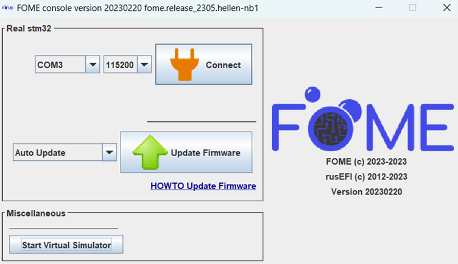
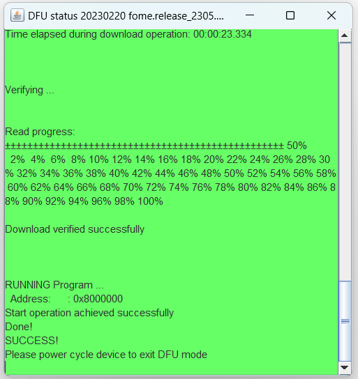
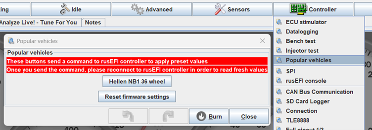

# Flashing the firmware

Flashing the firmware is easy to do however it is important to do it correctly to prevent errors or board misconfiguration. If you haven't already, read the guide on downloading the firmware and setting up TunerStudio [here](/Intro-Start-Here/Where-To-Get-Firmware/).

## Load the firmware onto the ECU

Once you have downloaded the [latest firmware bundle](https://github.com/FOME-Tech/fome-fw/releases), extract it then navigate through the *console* folder to *fome_console.exe* and launch it. Ensuring that TS is **not** running, plug your ECU into the computer. The console should detect the board and show a similar screen to below:

Click *Update Firmware* and leave the board plugged in until the prompt screen goes green and indicates that the update was successful. Only once the update has given this message, unplug and re-plug the ECU into the computer to reboot it.

If this does not complete successfully, the firmware may need to be loaded by putting the board into bootloader or DFU mode.

## Loading firmware in manual bootloader mode

In the event that your firmware update fails and the computer fails to recognize the ECU when plugged into it, the firmware needs to be loaded by manually putting the board into boot mode. When the computer fails to recognize the ECU, the firmware has not loaded correctly so the console is unable to automatically put it into bootloader (or DFU) mode to update it. This process manually puts the ECU into bootloader mode then uploads the firmware file to it.

On the ECU, you will then need to access the main board to find the boot/DFU pins/button. With the ECU un-powered, short the two boot pins (or push and hold the button) while plugging the ECU into the computer. Once plugged into the computer, the pins can be separated or the boot button released. If this has been done correctly, the console should come up with the manual DFU update selection.

Click *Update Firmware* and keep the board connected until the prompt screen goes green and indicates a successful update.

## Setting up TunerStudio

Open TS with the ECU plugged in, it should recognise that the ECU definition is out of date and come up with a prompt to update the ECU definition. Press *Update ECU definition* and if it cannot find it online, load the *.ini* file from the firmware bundle downloaded earlier

Next, under the *Controller* tab, open the *Popular Vehicles* menu and click the button to load the preset for your vehicle (not the button to reset the firmware settings).

Once the preset has been loaded, you can either start tuning or load your tune from the older firmware versions under *File > Load Tune (msq)*. After that, the update is complete!