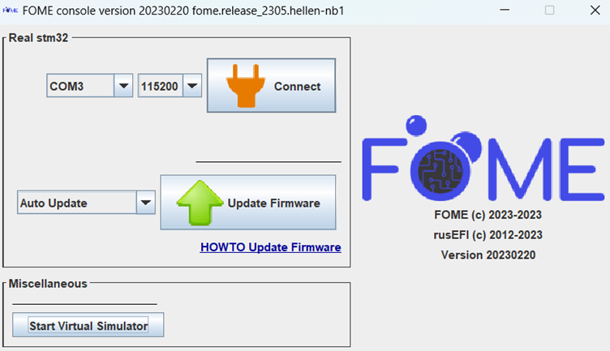

# Updating the Firmware

Updating the firmware is easy to do, however it is important to do it correctly to prevent errors or board
misconfiguration.  A guide to downloading FOME firmware and setting up TunerStudio can be found
[here](/Intro-Start-Here/Where-To-Get-Firmware/).

Updating firmware involves a process sometimes called "flashing" or even "programming" the ECU.  Generally, these all
refer to the same thing: taking the compiled FOME firmware and putting it into the non-volatile flash memory on the ECU.

## Updating the Firmware with FOME Console

After confirming the firmware to flash to the ECU, software to do so must be used.  FOME provides a utility, the **FOME
console**, which is capable of flashing firmware to supported ECUs and is the recommended way to update FOME firmware.
The FOME console is included with each firmware release, and bundles can be downloaded from [the release
page](https://github.com/FOME-Tech/fome-fw/releases).  As problems can arise during flashing, other tools and mechanisms
that are available for this procedure are documented below in [Other firmware flashing
tools](#other-firmware-flashing-tools).

After extracting the bundle contents, navigate to the `console/` directory and run the FOME console program (e.g.
`fome_console.exe` if using Windows).  After first confirming **TunerStudio is not running**, connect the ECU to the
computer.  FOME console will automatically detect the board and present similar to the display below:



Next, click *Update Firmware* and leave the board connected until the display notifies that the update was successful.
Only once the console has presented the success message, disconnected and re-connect the ECU into the computer to reboot
it with the new firmware.

If the update does not complete successfully, the firmware may need to be loaded using another mechanism documented
below in [Other firmware flashing tools](#other-firmware-flashing-tools).

## Setting up TunerStudio

With the ECU connected, open TunerStudio with the associated project.  TunerStudio will recognise that the project's ECU
definition is out of date and display a prompt to download or supply the new definition.

Next, under the *Controller* tab, open the *Popular Vehicles* menu and click the top button to load the preset for your
vehicle (**not the button to *Reset firmware settings***).


Once the preset has been loaded, you can either start tuning or load your tune from the older firmware versions under
*File > Load Tune (msq)*. After that, the update is complete!

## Other Firmware Flashing Tools

:::note

Some boards, notably those with processors utilizing certain dual bank memory layout, like the STM32F7, suffer from an
issue such that flashing does not succeed correctly, due to an error with the erasure mechanism.  For these situations,
manually erase the flash memory before flashing; i.e. perform a full/mass erase procedure first.

:::

In the event of a firmware update/flash failure, or some other firmware corruption issue, such that FOME console nor
TunerStudio recognize the ECU when connected, the firmware needs to be loaded to the ECU using another tool.  In these
situations, the FOME console cannot communicate with the firmware and so is unable to configure it into bootloader (or
DFU) mode for updating.  To flash the firmware, the ECU must be manually entered into the bootloader/DFU mode.

For the ECU, you will need to access buttons or pins on the main board to force the processor into bootloader/DFU mode.
Some boards use a momentary button, likely near to the reset button, to force this mode during power-up.  Others might
use a set of pins or pads that need shorted to force this mode during power-up.  Press the button or short the pins with
the ECU disconnected from the computer, then simultaneously connect the ECU into the computer.  Once connected, the
button can be released or the short removed.

### STM32CubeProgrammer

STM32CubeProgrammer is an officially STMicroelectronics supported tool to flash STM32 processors.  Information about
and how to download and install the tool can be found on [the STM
wiki](https://wiki.st.com/stm32mpu/wiki/STM32CubeProgrammer).

In STM32CubeProgrammer, select the *USB* tab on the right and refresh the port in the right side menu until a DFU is
detected. Click *Connect* to connect the ECU to the programmer. Click the *Read* button to read the device memory and to
validate that the ECU is connected.

Once validated, click the *Open File* button and load the file marked *fome.bin* within the firmware bundle downloaded
earlier. This is a binary file containing the ECU firmware. Now click the *Download* button to write this firmware to
the ECU. Give it up to several minutes to download and once the status console confirms successful download, disconnect
from the programmer then unplug the ECU and plug it back in. The ECU should now connect to the computer and TS normally
again.

### dfu-util

dfu-util is a free software tool to flash Device Firmware Upgrade (DFU) compatible devices, including STM32 processors.
It supports most popular operating systems, including MacOS and Linux.  Information about dfu-util can be found on [the
dfu-util website](https://dfu-util.sourceforge.net/).

Updating with dfu-util is as straight-forward as invoking it like so:

```sh
dfu-util -v -d 0483:df11 -a 0 -D fome.dfu -s :leave
```

Note that the `:leave` option does not always work, which would otherwise automatically instruct the processor to leave
DFU mode and load the firmware; the board must be manually reset to load the flashed firmware.

To erase a device, use the following invocation:

```sh
dfu-util -v -d 0483:df11 -a 0 -s :mass-erase:force
```
