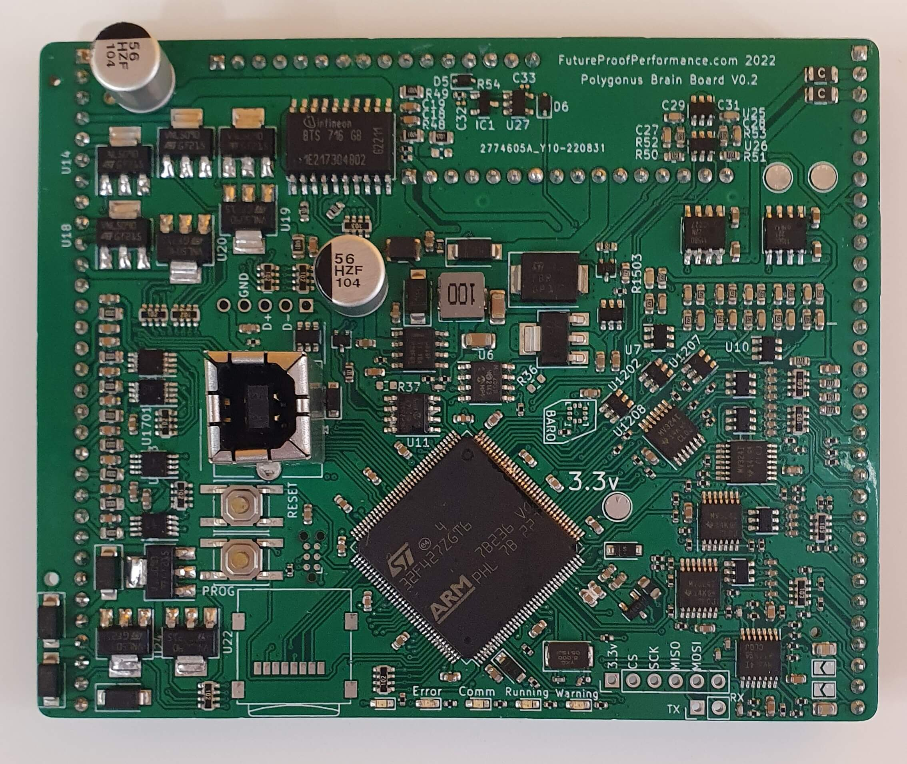
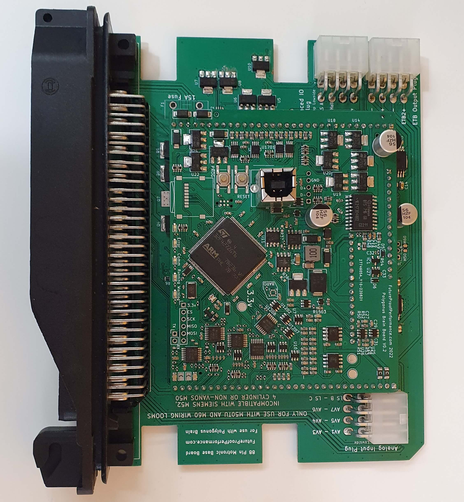
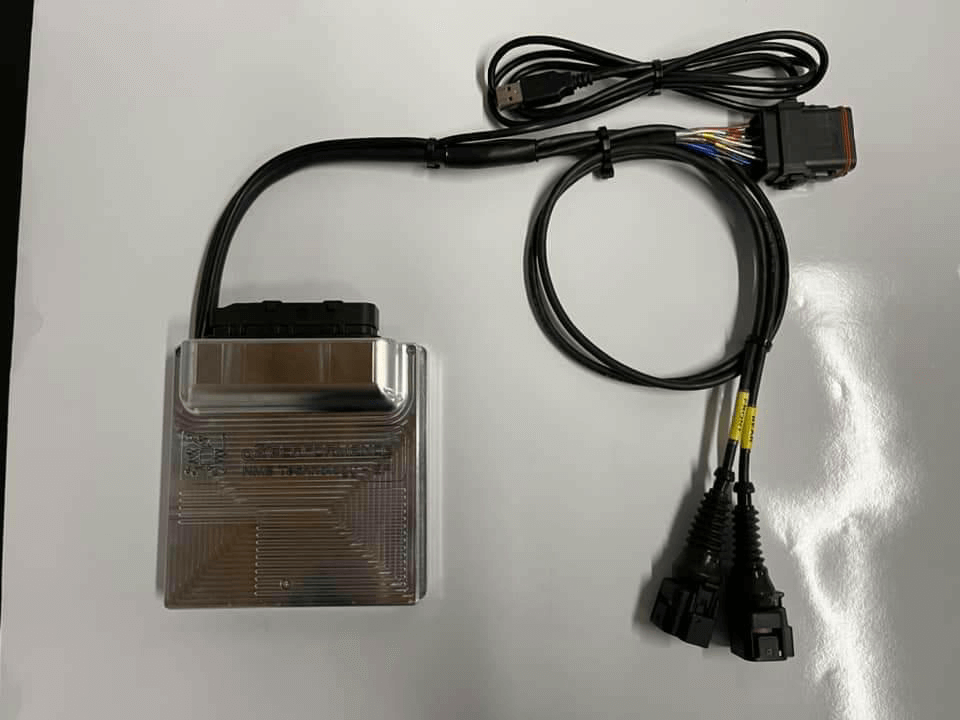

# Which FOME hardware to pick

Currently there are a few sweet options for hardware, all have the same brain, but with different baseboards.

## BRAIN

### Polygonus :brain:

This is where the real action happens. Designed to be consistent across different base board applications to simplify design, ensure repeatability, and reduce cost. The Polygonus (said Puh-LIG-on-us) Brain is on all FOME ECUs.

## BASEBOARDS

### BMW

For the M50TU and M60 engines (and harnesses), this plug and play FOME ECU will allow you to use your turn signals (cringe jokes). No but really, E36 Chassis is hot right now. Street/Drag/Drift you name it. Everyone who had an S-Chassis now wants an E36. Hell you could use this in other chassis too.

### Miata

You love big hair, short shorts, and tops off 24/7 (and stereotypes too). Luckily FOME has you in mind with a wide arrangement of options fot the Mazda Miata Platform. [BeerMoneyMotorsports](https://www.beermoneymotorsports.com/collections/miata-mx5-ecus) in sexy *billet* cases. NA,NB, 1.6, 1.8, VVT, turbo, ITBs, etc. You name, it, and its covered.

### Harley

Whether you're cruising the highways, crushing that 1/4 mile, or just want more power, the Harley FOME ECU (designed for 2021+ bikes) is an excellent choice. [NMSTEC](https://www.nmstec.ca/product/hdrevb/) has them available ready to go, also in a very nice *billet* case.

## Coming Soon

### Universal

Sometimes you don't know what car your engine is going in, or you want to do a swap. Regardless, a universal option is always good to have. It uses the common and reliable VAG (not that VAG, but Volkswagen Audi Group) plugs with a nice 120 pins. This means 8 cylinders of sequential fueling (up to 12 batch), plenty of inputs and outputs. (20 lowside, 4 highside, CANBUS, SD Card) It should be able to handle 95% of projects out there.

### Honda

VTEC baby
