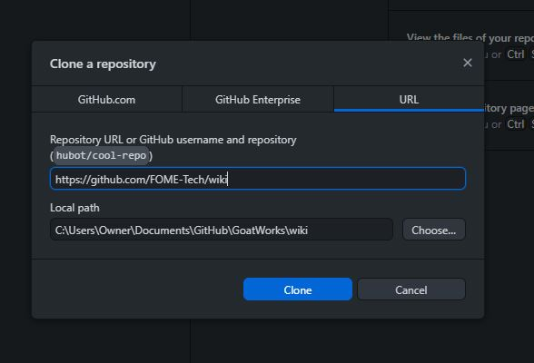
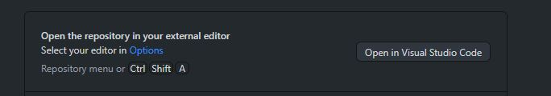
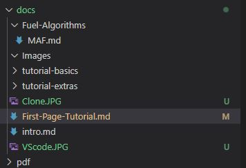
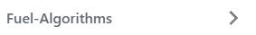
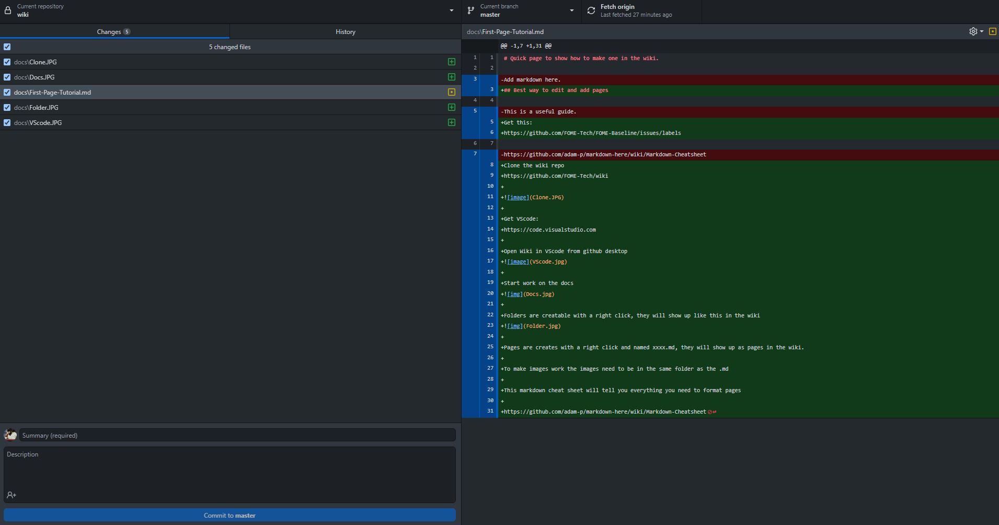
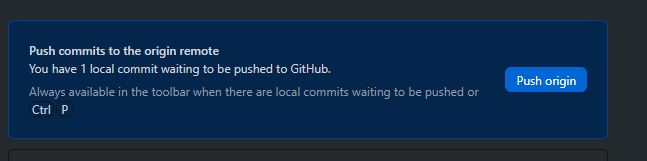

# Quick page to show how to make one in the wiki

## Best way to edit and add pages

Get this:
[https://github.com/FOME-Tech/FOME-Baseline/issues/labels](https://github.com/FOME-Tech/FOME-Baseline/issues/labels)

Clone the wiki repo
[https://github.com/FOME-Tech/wiki](https://github.com/FOME-Tech/wiki)



Get VScode:
[https://code.visualstudio.com](https://code.visualstudio.com)

Open Wiki in VScode from github desktop


Start work on the docs


Folders are creatable with a right click, they will show up like this in the wiki


Pages are creates with a right click and named xxxx.md, they will show up as pages in the wiki.

To make images work the images need to be in the same folder as the .md, they are also case sensitive so check capitals

This markdown cheat sheet will tell you everything you need to format pages

[https://github.com/adam-p/markdown-here/wiki/Markdown-Cheatsheet](https://github.com/adam-p/markdown-here/wiki/Markdown-Cheatsheet)

Save your work in VScode and go to github desktop

It will ask you for a title, description and to commit the changes (see bottom left of picture)



Once that is done you can push your changes and they will get automatically updated to the wiki



---

- Stuff!
- More stuff!
- Stuff that looks like stuff but isn't!

### Subtitle 1

#### Subtitle 2

##### Subtitle 3

### This kind of subtitle

You can also do **this** **[link](https://fome.tech)**

### What you'll need

- [Node.js](https://nodejs.org/en/download/) version 16.14 or above:
  - When installing Node.js, you are recommended to check all checkboxes related to dependencies.

## Start your site

Change directory:

```bash
cd wiki
```

Install NodeJS dependencies:

```bash
npm install
```

Run the development server:

```bash
npm start
```

The `cd` command changes the directory you're working with. In order to work with your newly created Docusaurus site, you'll need to navigate the terminal there.

The `npm install` installs all the dependencies for your site. You'll need to run this command once when you first download the project, and again only if you `package-lock.json` file changes.

The `npm start` command builds your website locally and serves it through a development server, ready for you to view at [http://localhost:3000](http://localhost:3000).

Open `docs/intro.md` (this page) and edit some lines: the site **reloads automatically** and displays your changes.
